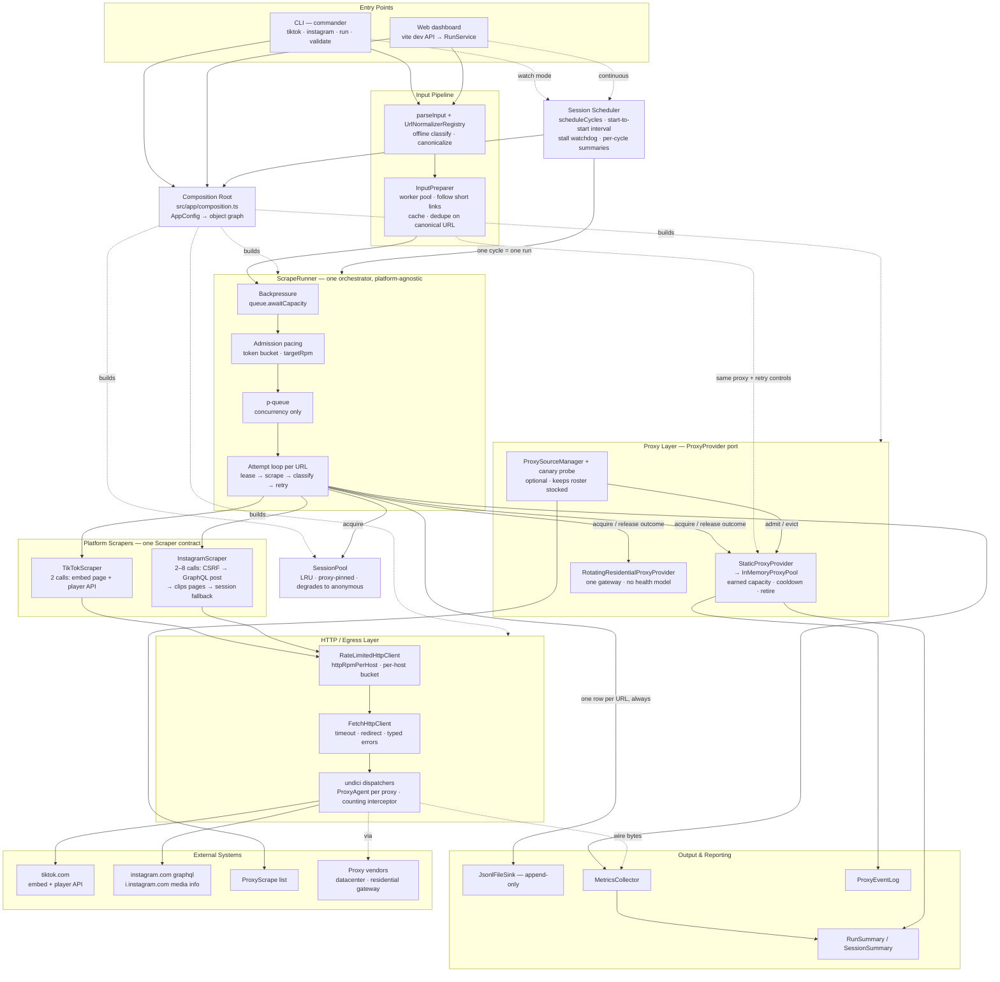
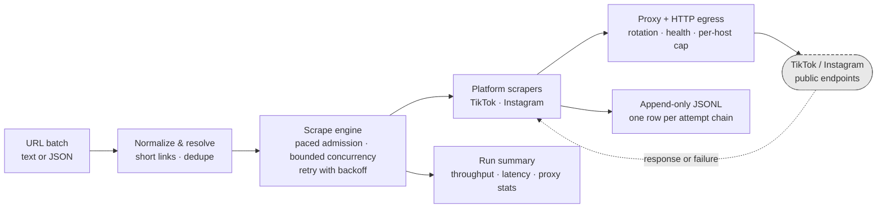
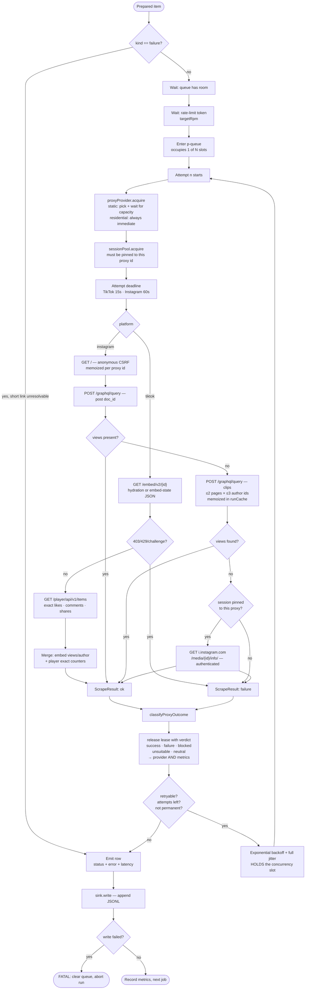
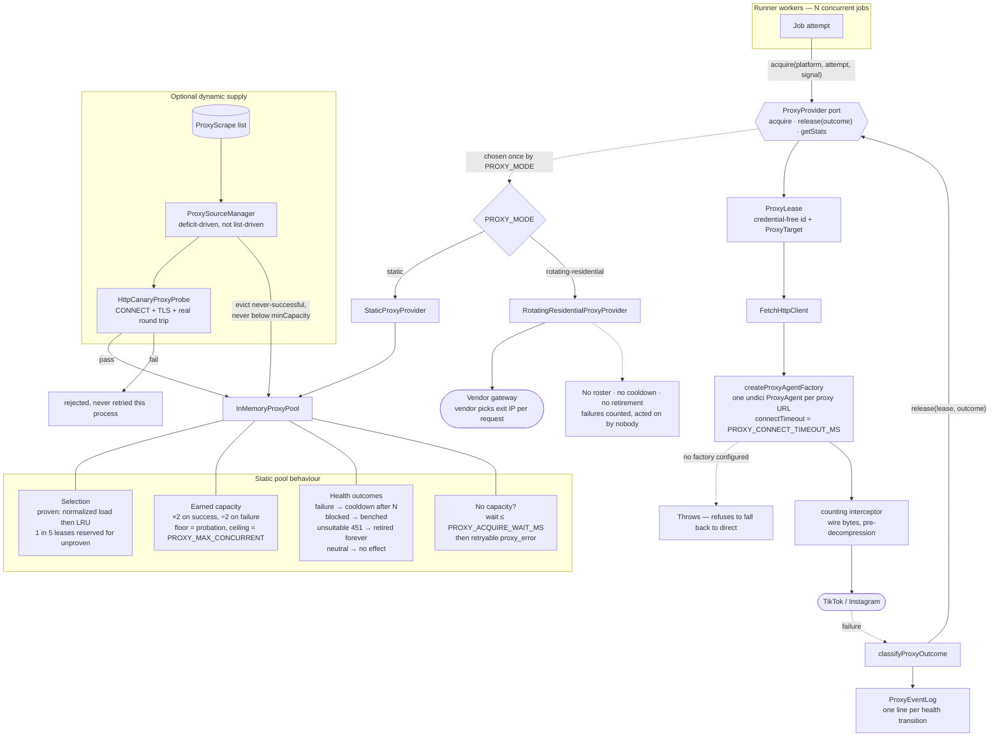

# Metric Scraper — Architecture-to-Presentation Analysis

**Context.** This is the technical presentation prep for the `metric-scraper-v1` take-home
(spec: `specification.txt` — TikTok + Instagram public engagement metric snapshots, JSONL
time series, 500 req/min sustained for 10 minutes, rotating proxy pool, no paid scraping
APIs). The goal is not documentation; it is a small set of accurate diagrams plus the
understanding needed to defend them under questioning. Everything below is derived from the
repository at commit `b7d8d41`; nothing is inferred from common patterns.

---

## 1. System Mental Model

**The system is a batch pipeline with two entry points and one engine.** A user supplies a
batch of TikTok or Instagram URLs — either through the Commander CLI (`src/cli/index.ts`,
commands `tiktok`, `instagram`, `run`, `validate`) or through a Vite-dev-only web dashboard
(`src/web/server/dev-api-plugin.ts` → `src/app/run-service.ts`). Both paths converge on one
composition root (`src/app/composition.ts`), which is the single place configuration becomes
objects. Below that line nothing knows whether it was started from a terminal or a browser.

**Input becomes canonical before any scraping happens.** `parseInput` (`src/core/input/parse-input.ts`)
reads either newline-delimited text or a JSON array and runs each entry through a platform
URL normalizer registry. Normalizers classify a URL and, where possible, extract the video
id without a network call. Short links — `vm.tiktok.com`, `vt.tiktok.com`, `/share/reel/`,
`instagr.am` — cannot be normalized offline, so they are flagged `requires_resolution` and
handed to the `InputPreparer` (`src/app/input-preparer.ts`), which runs a bounded worker pool
that leases a proxy, follows up to five redirects manually, and caches the result. Only after
resolution does it de-duplicate on the canonical URL, because two different short links can
point at the same video. A URL that cannot be resolved becomes a *pre-failed item*, not a
dropped one — it is carried into the run and emitted as a row with the resolution's latency
and attempt counts folded in.

**The runner is the engine, and it is platform-agnostic.** `ScrapeRunner`
(`src/core/runner/scrape-runner.ts`, ~550 lines) is the only orchestrator. Its producer loop
applies two independent gates *before* a job enters the queue: `queue.awaitCapacity(signal)`
is backpressure (bounded pending work, default 1000), and `rateLimiter.acquire(signal)` is
pacing (a token bucket built from `targetRpm`). Neither gate consumes a concurrency slot —
that separation is deliberate and is documented in `src/core/concurrency/task-queue.ts` as
the fix for an earlier bug where p-queue's `intervalCap` turned a configured concurrency of
10 into an effective concurrency of 1. Once admitted, the job goes into a p-queue configured
with concurrency and nothing else.

**One job is an attempt loop, and every outcome is a row.** Inside a job the runner leases a
proxy, then a session bound to that proxy, builds a per-platform attempt deadline
(`AbortSignal.any([runSignal, timeout])`), and calls `scraper.scrape(url, context)`. Whatever
comes back — success, typed failure, or a thrown exception — is turned into a `ScrapeResult`.
The result is classified once by `classifyProxyOutcome` (`src/core/runner/proxy-outcome.ts`)
and that single verdict is reported to *both* the proxy provider and the metrics collector, so
rotation state and the run summary can never disagree. Retryable failures back off with full
jitter and re-enter the loop, taking a fresh proxy lease each time. When the loop ends, the
runner builds a `MetricSnapshot` and writes it. A failed scrape is a complete, valid JSONL row
with null metrics and a `status`/`error` — the spec's "failures are rows, not silent drops."

**The only fatal error is an unwritable output.** If `sink.write` throws, the runner clears
the queue and aborts the run, because continuing would silently lose data. Everything else —
a dead proxy, a parse error, a blocked platform — is data that lands in a row and in the
summary.

**Platform differences are real and the architecture preserves them.** TikTok
(`src/platforms/tiktok/tiktok-scraper.ts`) makes exactly two anonymous requests: the public
embed page `/embed/v2/{id}`, which yields views, author and timestamp via a hydration/embed-
state JSON blob, and then the player API `/player/api/v1/items`, which supplies *exact*
likes/comments/shares that overwrite the embed page's values. Instagram
(`src/platforms/instagram/instagram-scraper.ts`) is a multi-stage hybrid: bootstrap an
anonymous CSRF cookie from the root page (memoized per proxy id for the life of the scraper
instance), POST a GraphQL `doc_id` query for the post, and — if the post response carries no
view count — walk up to two pages of a *clips* query across up to three author ids, memoized
in a run-scoped cache. Only if all of that fails does it fall back to an authenticated
`i.instagram.com/media/{id}/info/` call, and only when a session exists that is pinned to the
exact proxy currently leased. So TikTok is 2 HTTP calls per job; Instagram is 2 to 8+, which
is why they carry separate attempt timeouts (15 s vs 60 s).

**Proxies sit behind one narrow port with two implementations.** `ProxyProvider`
(`src/core/scraper/provider-ports.ts`) is `acquire` / `release(outcome)` / `getStats`, and
`PROXY_MODE` picks the implementation once at the composition root. `StaticProxyProvider`
wraps `InMemoryProxyPool`, which is where all the interesting behaviour lives: two-tier
rotation (normalized load then LRU for proven proxies, with 1 lease in 5 reserved for
exploration of unproven ones), *earned* per-proxy capacity that doubles on success and halves
on failure up to a ceiling, three distinct health outcomes (cooldown, detected block, permanent
retirement for HTTP 451 geo-blocks), and a bounded wait for capacity before it declares
exhaustion. `RotatingResidentialProxyProvider` is the deliberate opposite — it counts failures
and acts on none of them, because benching a gateway over one lost exit IP would take the whole
run offline. Optionally a `ProxySourceManager` keeps the static pool stocked from a live
ProxyScrape list, validating candidates with an HTTPS canary probe before admission.

**Rate limiting exists at two tiers because one job is not one request.** `targetRpm` paces
*job admission* in the runner and is the number the summary reports against the acceptance
target. `httpRpmPerHost` (`src/infrastructure/http/rate-limited-http-client.ts`) wraps the
transport itself and paces *actual outbound requests per host*, retries and multi-hop calls
included — that is the tier that protects upstream. It defaults to off. Waiting at the HTTP
tier happens inside a job and therefore does consume a concurrency slot; that is genuine
backpressure and is measured via `onWait` so it stays visible in the summary's `waits` block.

**Output is append-only and observability is first-class.** `JsonlFileSink` opens with flag
`a`, validates every row against a Zod schema, respects stream backpressure, and never
rewrites or de-duplicates — repeated scrapes of the same URL are supposed to produce new rows.
Alongside it, `MetricsCollector` accumulates status counts, latency samples, retry counts,
per-proxy usage, queue stats and four categories of wait time; `buildRunSummary` turns that
plus `proxyProvider.getStats()` into the `*.summary.json` the spec asks for; and `ProxyEventLog`
writes a separate `*.proxy-events.jsonl` recording every proxy health *transition*.

**Continuous mode is the same engine on a timer.** `runSession` (`src/app/scrape-session.ts`)
drives `scheduleCycles` (`src/core/schedule/interval-scheduler.ts`), a generator that yields
one cycle at a time with start-to-start interval accounting so a session does not drift. Each
cycle builds a *fresh runner and sink* but reuses the *same proxy provider, session pool and
resolution cache* — because proxy cooldowns are measured in minutes and rebuilding the pool
every cycle would silently un-bench every proxy that had just been benched. A stall watchdog
flags a cycle where work is in flight but nothing has completed; a cycle that throws is
recorded and the session carries on; only an unwritable output ends the session.

---

## 2. Major Components

| # | Component | Responsibility | Inputs | Outputs | Depends on | Why it exists | Implementation |
|---|-----------|----------------|--------|---------|------------|---------------|----------------|
| 1 | **Entry Points** | Parse invocation, gather options, own run lifecycle | argv / HTTP POST | run + summary on stdout or polled DTO | Composition Root | Two audiences — operator and demo — must not become two engines | `src/cli/index.ts`, `execute-batch.ts`, `execute-session.ts`, `src/app/run-service.ts`, `src/web/server/dev-api-plugin.ts` |
| 2 | **Input Pipeline** | Parse, classify, normalize, network-resolve short links, de-duplicate | raw text/JSON batch | `PreparedInputItem[]` + rejection issues | HTTP, ProxyProvider, RetryPolicy | Spec §4 demands mixed URL formats; resolution needs the same proxy/retry controls as scraping | `src/core/input/parse-input.ts`, `src/core/url/*`, `src/app/input-preparer.ts`, `src/platforms/*/*-url-{normalizer,resolver}.ts` |
| 3 | **Composition Root** | Turn `AppConfig` into a wired object graph, once | `AppConfig`, `Logger`, `SnapshotSink` | `BuiltRunner` | everything below | Single place `PROXY_MODE` and every other switch is resolved | `src/app/composition.ts`, `src/config/env.ts` |
| 4 | **ScrapeRunner** | Admission pacing, backpressure, concurrency, attempt/retry loop, lease lifecycle, row emission | prepared items | `MetricSnapshot` per URL, `RunSummary` | TaskQueue, RateLimiter, ScraperRegistry, ProxyProvider, SessionPool, Sink, Metrics | The one orchestrator; knows nothing about TikTok or Instagram | `src/core/runner/scrape-runner.ts`, `src/core/concurrency/task-queue.ts`, `src/core/rate-limit/rate-limit.ts`, `src/core/retry/retry-policy.ts` |
| 5 | **Session Scheduler** | Repeat a batch on a fixed start-to-start cadence; aggregate cycles | schedule + records | `SessionSummary`, per-cycle summaries, throughput timeline | ScrapeRunner, ProxyProvider (shared) | Spec's time-series purpose + the 10-minute sustained-throughput run | `src/app/scrape-session.ts`, `src/core/schedule/interval-scheduler.ts` |
| 6 | **Platform Scrapers** | Answer "what are this URL's metrics, or why not" | canonical URL + `ScrapeContext` | `ScrapeResult` | `HttpClient` port only | Isolates the volatile, undocumented part of the system behind one contract | `src/platforms/tiktok/*`, `src/platforms/instagram/*` |
| 7 | **HTTP / Egress Layer** | Timeouts, headers, redirects, proxy dispatch, per-host rate cap, wire-byte accounting | `HttpRequest` | `HttpResponse` or typed `HttpError` | undici | Only tier that can see *all* traffic including retries and multi-hop calls | `src/core/scraper/http-port.ts`, `src/infrastructure/http/{fetch,rate-limited}-http-client.ts`, `counting-dispatcher.ts` |
| 8 | **Proxy Layer** | Provide an outbound route per attempt; own what a failure means | `ProxyRequestContext` | `ProxyLease` \| `null`, `ProxyProviderStats` | ProxySource, ProxyProbe | Spec §3 requires a rotating pool; two very different vendor models behind one port | `provider-ports.ts`, `static-proxy-provider.ts`, `in-memory-proxy-pool.ts`, `rotating-residential-proxy-provider.ts`, `proxy-source-manager.ts`, `http-canary-proxy-probe.ts` |
| 9 | **Session Pool** | Rotate operator-supplied logged-in identities, pinned to a proxy | platform + proxy id | `SessionLease` \| `null` | — | Spec §3's "pool of sessions with rotation… degrade gracefully"; only Instagram's exact-views fallback uses it | `src/infrastructure/session/*` |
| 10 | **Output & Reporting** | Append-only JSONL, metrics accumulation, run/session summaries, proxy event log | snapshots + metric events | `*.jsonl`, `*.summary.json`, `*.proxy-events.jsonl` | — | Spec §5 and §7; the durable artifact, since there is no database | `jsonl-file-sink.ts`, `metrics-collector.ts`, `build-{summary,session-summary,proxy-summary}.ts`, `run-paths.ts`, `proxy-event-log.ts` |

**Presentation classification**

- **Must understand deeply:** the two-gate producer loop and why pacing is separate from
  concurrency (#4); the attempt/retry loop and lease lifecycle (#4); `classifyProxyOutcome`
  as the single definition of proxy health; the static-vs-residential health asymmetry (#8);
  the earned-capacity model and how it caps effective concurrency; TikTok's 2-call vs
  Instagram's 2–8-call shape; append-only output semantics (#10).
- **Useful context:** the composition root as the only wiring point; the port/adapter layering
  (`core` imports nothing from `platforms` or `infrastructure`); the session scheduler; the
  bandwidth interceptor and why it sits at the dispatcher; the dynamic proxy source manager.
- **Implementation detail (real, but keep out of the main deck):** the exact TikTok hydration
  script ids and embed-state fallback; Instagram `doc_id` values and the clips pagination
  bounds; `LatestWins` bandwidth-refresh ordering; the timeline cursor on the dashboard poll;
  the ProxyScrape candidate-state machine; `terminalCause` error-chain walking.

---

## 3. Diagram 1 — Complete System Architecture



**What it communicates.** Input enters at two doors and immediately becomes canonical.
Everything is wired once at the composition root. The runner is a three-stage funnel —
backpressure, pacing, concurrency — followed by a per-URL attempt loop that leases from the
proxy and session layers and delegates the platform-specific part to one of two scrapers.
All egress passes through a single client chain, which is where the per-host rate cap and the
wire-byte counter live. Every outcome produces a row; the summary is assembled from the
metrics collector plus the provider's own stats.

---

## 4. Diagram 2 — Simplified Presentation Architecture



**What it communicates.** Six boxes, left to right: URLs in, made canonical, run through a
paced and bounded engine, translated by per-platform scrapers, sent out over a rotating proxy
layer, and landing as append-only JSONL plus a run summary. The only external system is the
platforms themselves (dashed). This is the slide.

---

## 5. Diagram 3 — Request / Scraping Execution Flow



**What it communicates.** The two admission gates are outside the concurrency slot; the
attempt loop is inside it. The lease is per *attempt*, not per job — which is what makes a
retry naturally land on a different proxy without anyone arranging it. The platform branch is
genuinely asymmetric: TikTok is a fixed two-call sequence where the second call exists purely
for count exactness; Instagram is a cascade with three escalating tiers and two memoization
layers. Both converge on one classification step whose verdict goes to two places. Retry
backoff is drawn as holding the slot because it does.

---

## 6. Diagram 4 — Proxy / Network Architecture



**What it communicates.** Why proxies exist (platform-side IP blocking at volume), how a
worker touches them (a narrow four-method port, one lease per attempt), and the fact that the
two modes differ in exactly one thing — what a failure *means*. Static owns health: earned
capacity, cooldowns, permanent retirement for geo-blocks, a bounded wait before declaring
exhaustion. Residential owns nothing, on purpose. The integration point with HTTP is one
undici `ProxyAgent` per distinct proxy URL, with an explicit connect timeout, and a hard
refusal to silently go direct if a proxy was assigned but no dispatcher factory exists.

---

## 7. Diagram Validation

### Diagram 1 — Complete Architecture

| Diagram Element | Repository Evidence | Confidence |
|---|---|---|
| CLI entry with 4 commands | `src/cli/index.ts:135-239` — `tiktok`, `instagram`, `run`, `validate` | High |
| Web dashboard is dev-only | `src/web/server/dev-api-plugin.ts:33-56` — `apply: 'serve'`, Vite plugin; README §7, §12 | High |
| Both paths share composition root | `execute-batch.ts:78` and `run-service.ts:488` both call `buildRunner` | High |
| Input pipeline: parse → resolve → dedupe | `parse-input.ts`; `input-preparer.ts:60-112` (worker pool, dedupe on canonical URL) | High |
| Two gates before queue entry | `scrape-runner.ts:227-243` — `awaitCapacity` then `rateLimiter.acquire`, then `submit` | High |
| p-queue = concurrency only | `task-queue.ts:71` — `new PQueue({ concurrency })`, no interval/intervalCap | High |
| Token bucket for targetRpm | `rate-limit.ts:119-131`; runner builds it at `scrape-runner.ts:140-146` | High |
| Session scheduler reuses one provider across cycles | `scrape-session.ts:189-201, 344-355` — provider/sessionPool passed into per-cycle `buildRunner` | High |
| HTTP chain: rate-limited → fetch → dispatcher | `composition.ts:116-139` | High |
| One ProxyAgent per proxy URL + connect timeout | `composition.ts:194-219` | High |
| Counting interceptor at dispatcher level | `counting-dispatcher.ts:13-26` (doc: port would overstate ~5×); `composition.ts:118-125` | High |
| ProxySourceManager feeds the pool | `composition.ts:271-287`; `proxy-source-ports.ts:143-156` (`ProxyRoster`) | High |
| Proxy events written separately | `run-service.ts:473-477`, `scrape-session.ts:181-185`, `proxy-event-log.ts` | High |
| Bandwidth folded into metrics before summary | `scrape-runner.ts:272-274` | High |
| InputPreparer uses same proxy + retry controls | `input-preparer.ts:200-231`, wired at `composition.ts:160-170` | High |

### Diagram 2 — Presentation Architecture

| Diagram Element | Repository Evidence | Confidence |
|---|---|---|
| "Normalize & resolve" as one conceptual stage | Collapses `parse-input.ts` + `url/*` + `input-preparer.ts` + 2 resolvers — a deliberate grouping, all one responsibility | High |
| "Scrape engine" as one box | `ScrapeRunner` + `TaskQueue` + `RateLimiter` + `RetryPolicy`, all under `scrape-runner.ts:117-303` | High |
| "Proxy + HTTP egress" as one box | Collapses `src/infrastructure/http/*` + `src/infrastructure/proxy/*`; both are reached only through ports in `src/core/scraper` | High |
| Append-only JSONL, one row per attempt chain | `jsonl-file-sink.ts:81` (`flags: 'a'`), `scrape-runner.ts:500-514` (one snapshot per `processRecord`) | High |
| Run summary contents | `run-summary.ts`, `build-summary.ts`, sample `output/*.summary.json` | High |

### Diagram 3 — Request Execution

| Diagram Element | Repository Evidence | Confidence |
|---|---|---|
| Pre-failed resolution items skip the scraper | `scrape-runner.ts:313-330`; test `scrape-runner.test.ts:134` | High |
| Lease acquired per attempt, inside the loop | `scrape-runner.ts:388-411` (inside `while (attempt < maxAttempts)`) | High |
| Session must be pinned to leased proxy | `in-memory-session-pool.ts:73-88`; `instagram-scraper.ts:370-374` | High |
| Per-platform attempt deadline | `scrape-runner.ts:416-417`; `env.ts:215-221` (15 s / 60 s); test at `scrape-runner.test.ts:374` | High |
| TikTok: embed page then player API | `tiktok-scraper.ts:45-59` then `:126-139`; merge at `:145` | High |
| TikTok challenge-page detection | `tiktok-scraper.ts:112-122, 224-236` | High |
| TikTok 403 → status `rate_limited`, code `blocked` | `tiktok-scraper.ts:79-85` | High |
| Instagram CSRF bootstrap memoized per proxy id | `instagram-scraper.ts:221-233` (`anonymousStates`, key = `proxy?.id ?? 'direct'`) | High |
| Instagram clips: ≤2 pages × ≤3 authors, run-cached | `instagram-scraper.ts:56-59, 109-126, 300-332` | High |
| Instagram authenticated fallback last | `instagram-scraper.ts:135-137, 165-219` | High |
| Single classification → provider + metrics | `scrape-runner.ts:443-458` | High |
| Backoff holds a concurrency slot | `scrape-runner.ts:480-489` — the sleep is inside the queued task; comment says so explicitly | High |
| Permanent statuses never retried | `retry-policy.ts:73-77` + `isPermanentStatus`; test `scrape-runner.test.ts:237` | High |
| Output failure is fatal, clears queue, aborts | `scrape-runner.ts:182-196`; test `scrape-runner.test.ts:286` | High |
| Thrown value becomes a row, not a lost job | `scrape-runner.ts:435-439, 533-537`; test `scrape-runner.test.ts:187` | High |

### Diagram 4 — Proxy Architecture

| Diagram Element | Repository Evidence | Confidence |
|---|---|---|
| Four-method provider port | `provider-ports.ts:54-73` | High |
| Mode chosen once at composition | `composition.ts:315-324` | High |
| Two-tier selection, 1-in-5 exploration | `in-memory-proxy-pool.ts:816-829`; `env.ts:243` (`PROXY_EXPLORATION_PERIOD` default 5) | High |
| Earned capacity ×2 / ÷2 | `in-memory-proxy-pool.ts:871-894` | High |
| 451 → `unsuitable` → permanent retirement | `proxy-outcome.ts:39`; `in-memory-proxy-pool.ts:558-590`; `pool-ports.ts:58, 210` | High |
| Bounded acquire wait then retryable error | `in-memory-proxy-pool.ts:400-458`; `env.ts:245` (5000 ms default) | High |
| `neutral` outcome affects nothing | `proxy-outcome.ts:55-63`; `static-proxy-provider.ts:47-49` | High |
| Residential: no health model, never returns null | `rotating-residential-proxy-provider.ts:24-36, 68-78, 118-128` | High |
| Probe validates CONNECT + TLS + round trip | `proxy-source-ports.ts:41-59`; `http-canary-proxy-probe.ts`; `docs/proxy-validation-measurement.md` | High |
| Source is deficit-driven, evicts above a floor | `proxy-source-manager.ts:82-98, 163-193`; option docs at `:36-52` | High |
| Refuses to fall back to direct when proxy assigned | `fetch-http-client.ts:73-84` | High |
| SOCKS unsupported, fails loudly | `composition.ts:200-204` | High |

### Uncertain / not represented

| Item | Note |
|---|---|
| Sticky proxy sessions | `ProxyRequestContext` carries `platform` + `attempt` for this, but **nothing derives a session id today** (`provider-ports.ts:18-30`, README §2). Deliberately **not** drawn. |
| Rotating residential against a live gateway | Unit-tested only; never run against a paid account (README §12). Drawn as existing code, which it is — but say "implemented, unvalidated" if asked. |
| `LeaseOutcome` vs `ProxyOutcome` for sessions | Sessions use the narrower three-value vocabulary (`scrape-runner.ts:517-529`); the diagram shows only the proxy five-value one. Simplification, not a misrepresentation. |

---

## 8. Interviewer Questions — grouped, with what to study

### Design decisions
1. *Why is rate limiting separate from the task queue?* → `task-queue.ts:3-18` and `rate-limit.ts:1-19` both document the exact bug this prevents. **Study this; it is the single best answer in the repo.**
2. *Why two rate-limit tiers?* → `targetRpm` = jobs, `httpRpmPerHost` = actual requests. One TikTok job is 2 requests; one Instagram job is 2–8. Study `rate-limited-http-client.ts:20-33`.
3. *Why does `classifyProxyOutcome` exist as a separate pure function?* → so rotation state and the summary cannot disagree; and so `retryable` (a retry decision) never doubles as a health decision. Study `proxy-outcome.ts:5-29`.
4. *Why does `acquire` returning `null` mean "go direct"?* → keeps the proxy path exercised with no credentials; but a residential provider never returns null. `pool-ports.ts:191-199`, `provider-ports.ts:56-63`.
5. *Why is the web dashboard in the Vite dev server rather than a real service?* → `dev-api-plugin.ts:21-32`.

### Tradeoffs
6. *Why does TikTok make a second call?* → the embed page's like/comment/share counters are not authoritative; the player API supplies exact integers, which spec §5 requires. Cost: 2× request volume and a second failure surface — if the player call fails, the whole job fails even though views were already in hand.
7. *Why is Instagram's clips walk bounded at 2 pages × 3 authors?* → unbounded search per URL would be unbounded cost. Missing exact views is never reported as success (`instagram-scraper.ts:140-150`).
8. *Why does residential have no health model?* → benching a gateway over a lost exit IP takes the whole run offline. `rotating-residential-proxy-provider.ts:24-36`.
9. *Why earned capacity instead of a flat per-proxy limit?* → the doc comment at `in-memory-proxy-pool.ts:856-870` explains that keying capacity on the last outcome made pool capacity equal the *number* of usable proxies rather than `proxies × limit`.

### Reliability & error handling
10. *What is the one fatal error?* → an unwritable output. Everything else is a row. `scrape-runner.ts:182-196`.
11. *How do you guarantee no silent drops?* → `processRecord` always resolves with a snapshot; thrown values are converted at `:435-439`; pre-failed resolution items still emit rows at `:313-330`.
12. *What happens when the whole pool is benched?* → bounded wait, then a **retryable** `proxy_error`, so the retry policy's backoff absorbs it. `in-memory-proxy-pool.ts:435-457`.
13. *How would you know a long run stalled?* → the session watchdog: work in flight and nothing completing for `max(30s, 3× requestTimeout)`. `scrape-session.ts:236-240, 296-306`.
14. *What breaks first when a platform changes?* → the parsers. They fail as visible `parse_error` rows, classified `neutral` so they never bench a proxy. `proxy-outcome.ts:52-55`.

### Concurrency
15. *What actually bounds throughput?* → **Little's Law.** Max rpm ≈ `concurrency / mean latency × 60`, further capped by the pool's *earned* capacity. See §9.1 — know this cold.
16. *Where can a concurrency slot sit idle?* → retry backoff (`scrape-runner.ts:480-489`), HTTP-tier rate-limit waits (`rate-limited-http-client.ts:30-33`), and proxy-capacity waits (`in-memory-proxy-pool.ts:427-433`). All three are measured into `summary.waits`.
17. *How do you prove the configured concurrency was actually reached?* → `TaskQueueStats.peakInFlight` and the summary's `concurrency.max_observed` / `effective` / `utilization`. Tests at `scrape-runner.test.ts:477-546`.

### Rate limiting & proxy behaviour
18. *Why a token bucket rather than a fixed window?* → a fixed window can emit two windows' budget in one second at the boundary. `rate-limit.ts:106-116`.
19. *Why is a proxy leased per attempt?* → a retry then lands on a different exit node without either provider arranging it. README §2.
20. *What does HTTP 451 mean to the pool?* → `unsuitable` → permanent retirement, because no cooldown moves an IP to another jurisdiction.
21. *How do you keep a free-proxy pool stocked?* → deficit-driven `ProxySourceManager` + an HTTPS canary probe. Have `docs/proxy-validation-measurement.md` ready — measured 76% of TCP-passing candidates cannot complete an HTTPS request.

### Performance & scalability
22. *Does this hit 500 rpm?* → **Answer honestly.** See §9.1. Measured 227–285 rpm (TikTok) and 118 rpm (Instagram) at concurrency 10.
23. *How do you scale horizontally?* → `TaskQueue`, `RateLimiter`, `ProxyProvider`, `SessionPool`, `SnapshotSink` are ports; distributed implementations swap in without touching `ScrapeRunner`. But **every limit is currently process-local and multiplies across workers** — README §12 has the table.
24. *Proxy bandwidth per 1000 requests?* → measured 32.5 KB/request on Instagram (`output/instagram-2026-08-21T00-56-37-206Z.summary.json`) ⇒ ~32.5 MB per 1000 requests. Counted pre-decompression at the dispatcher, because that is what vendors bill.

### Testing
25. *How do you test concurrency and rate limiting?* → injected `now`/`sleep`/`createQueue`/`createTimeoutSignal` seams on `ScrapeRunnerDeps`; `tests/rate-limit/rate-limit.test.ts` has a dedicated "concurrency and rate limiting together" suite.
26. *How do you test scrapers without hitting the network?* → `ScrapeContext.http` is a port; parsers are pure functions over sanitized fixtures (`tests/platforms/*`).
27. *Coverage shape?* → 59 test files, ~60 suites; heaviest around the proxy pool (1271-line test file) and the runner.

---

## 9. Architectural Risks / Surprises

### 9.1 The 500 rpm acceptance target is not met by the measured runs — **know this before you walk in**

**What it is.** Session summaries in `output/`:

| Run | Platform | Cycles | Requests | Success | active_rpm | `sustained_target_ms` | p50 latency |
|---|---|---|---|---|---|---|---|
| `tiktok-…14-32-30` | tiktok | 10 | 200 | 100% | **227** | 1000 ms | 1600 ms |
| `tiktok-…14-25-50` | tiktok | 5 | 100 | 100% | **286** | 1011 ms | 1470 ms |
| `instagram-…14-29-33` | instagram | 10 | 200 | 90% | **118** | 1000 ms | 4030 ms |

`sustained_target_ms: 1000` means the target rate was held for **one second**, not ten minutes.
The README (§13) already states this is outstanding work.

**Why it matters.** It is acceptance criterion #2. Correctness and reliability are fine; this
is a *capacity* gap.

**Affects:** performance. Not correctness — the rows written are valid and complete.

**Mention proactively:** yes. Volunteering it with the arithmetic is far stronger than being
caught by it.

**How to answer.** "Throughput here is Little's Law, and I can show you the arithmetic rather
than guess. Concurrency 10 at a 1.6 s TikTok p50 gives `10 / 1.6 × 60 ≈ 375` rpm ceiling; I
measured 227–286. Instagram at 4.0 s p50 gives `10 / 4 × 60 = 150`; I measured 118. So the
system is running at roughly 75–80% of its structural ceiling, and the ceiling itself is set
by concurrency and latency, not by the pacer — `targetRpm` was 500 the whole time and never
bound. To reach 500 rpm on Instagram I need concurrency around 35–40, and — this is the part
that bites — the static pool's *earned* capacity has to reach that number too. In these runs
`proxies.capacity` was 30–80 across 10 proxies with an 8-slot ceiling, and
`concurrency.saturated` was `true` with `effective` at 7.3–8.1 against a configured 10, so I
was already proxy-capacity-bound, not queue-bound. The fix is more proxies and higher
concurrency, and both are config, not code. What I have not done is the run that proves it."

### 9.2 Effective concurrency is capped by *earned* proxy capacity, not by `SCRAPER_CONCURRENCY`

**What it is.** Every proxy starts at `probationConcurrency` (1) and doubles its slots only on
success (`in-memory-proxy-pool.ts:879-883`). A pool of 10 proxies with `PROXY_MAX_CONCURRENT=8`
has a *theoretical* 80 slots but reports whatever it has actually earned — 30, 32, 72, 80 across
the sampled runs. When earned capacity is below the configured concurrency, jobs wait in
`acquire`, which shows up as `waits.proxy_acquire_ms` (1558 ms in one 20-URL run).

**Why it matters.** Someone comparing `SCRAPER_CONCURRENCY=50` against observed throughput will
conclude the queue is broken. It is not; the pool is the binding constraint.

**Affects:** performance; also makes the two proxy modes non-comparable on throughput without
first raising `PROXY_MAX_CONCURRENT` (README §2 caveat).

**Mention proactively:** yes, as part of the §9.1 answer — it is the *reason* the ceiling is
lower than concurrency suggests.

**How to answer.** "Capacity is earned rather than granted, so a cold pool starts at one slot
per proxy. That is a deliberate bound on how much work a dead IP can absorb before its first
failure is reported. The cost is a warm-up ramp, and the summary reports the real number as
`proxies.capacity` so it is never a mystery."

### 9.3 `targetRpm` counts jobs, not requests — upstream sees several times the configured rate

**What it is.** One TikTok job = 2 HTTP requests. One Instagram job = 2 minimum, up to 8+
(CSRF + post + 3 authors × 2 clips pages + media-info), plus retries. `httpRpmPerHost` is the
only knob that caps actual egress, and it **defaults to 0 = off** (`env.ts:210`). The Instagram
run above shows 51 platform HTTP requests for 20 jobs — **2.55× amplification** — and that was
with the run cache already deduplicating clips calls.

**Why it matters.** At a hypothetical 500 job-rpm, Instagram could be issuing ~1300–4000
requests/min at instagram.com. That is the number that gets you blocked, and it is invisible
to the job-level pacer.

**Affects:** reliability (block risk) and cost.

**Mention proactively:** yes — it demonstrates you understand what the acceptance number does
and does not measure.

**How to answer.** "The spec's 500 req/min is denominated in logical scrapes, and the summary
reports it that way. But upstream protection has to be denominated in actual requests, which
is why there is a second limiter at the `HttpClient` port — every request goes through it,
retries and multi-hop calls included. It ships off by default because I had not measured a
safe ceiling yet; `totals.platform_http_requests` in the summary is the number I would set it
from."

### 9.4 Instagram had a 10% `parse_error` rate in the most recent runs

**What it is.** `instagram-…14-29-33`: 20 of 200 failures, all `parse_error`. `instagram-…00-56-37`:
3 of 20, all `parse_error`. Parse errors are non-retryable (`instagram-scraper.ts:463-469`) and
classified `neutral` for proxy health.

**Why it matters.** Acceptance criterion #3 is ≥95% success on live URLs. 90% misses it, and
the failures are ours (a parser/response-shape mismatch) rather than the platform's.

**Affects:** correctness of the dataset (missing rows' worth of data) and the acceptance bar.

**Mention proactively:** yes if you show a summary; otherwise answer honestly when asked.

**How to answer.** "That is the known fragility the spec asks me to document. Instagram's
operations are undocumented first-party GraphQL, so a response-shape change surfaces as a
visible `parse_error` row rather than as a fabricated metric — which is the behaviour I
wanted. Classifying it `neutral` for proxy health is deliberate: blaming the proxy for our own
parser would bench the whole pool over one deploy-shaped bug. What I have not done is chase
this specific 10% down to a root cause."

### 9.5 Retry backoff and HTTP rate-limit waits hold a concurrency slot

**What it is.** `scrape-runner.ts:480-489` sleeps *inside* the queued task. `RateLimitedHttpClient`
waits inside a job too, and says so at `:30-33`.

**Why it matters.** With `maxAttempts=3` and up to 10 s max delay, a burst of rate-limited jobs
can park most of the pool in backoff. Effective concurrency drops even though nothing is wrong.

**Affects:** performance.

**Mention proactively:** only if concurrency or backoff comes up.

**How to answer.** "It is genuine backpressure, not a bug — but it is indistinguishable from
one unless it is measured, so both are accumulated into `summary.waits` as
`retry_backoff_ms` and `http_rate_limit_ms`. If those dominate, the answer is to lower the
target rate, not to raise concurrency."

### 9.6 The Instagram authenticated fallback rarely fires in a rotating pool

**What it is.** A session is only usable when `session.proxyId === leasedProxy.id`
(`in-memory-session-pool.ts:73-78`, `instagram-scraper.ts:370-374`). With 10 rotating proxies
and one pinned session, the fallback is available on roughly 1 attempt in 10; otherwise the job
returns `session_error` (`instagram-scraper.ts:140-150`).

**Why it matters.** Spec §3 asks for session-pool rotation and graceful degradation. The
degradation works; the *availability* of the fallback is structurally low.

**Affects:** reliability of exact-view capture for old Reels.

**Mention proactively:** no. Answer if Instagram sessions come up.

**How to answer.** "Pinning is not optional — Instagram invalidates a session that appears from
a new IP, so a session that is not proxy-bound burns itself. The consequence is that the
fallback's availability is `sessions ÷ proxies`. The right fix is a session per proxy, or
sticky proxy sessions so a given job keeps its exit IP; the port already carries the context a
sticky strategy needs, I just did not guess the vendor's username format."

### 9.7 TikTok's second call is an availability liability

**What it is.** If the player API returns non-2xx or fails to parse, the entire job fails
(`tiktok-scraper.ts:141-145`) — even though views, author, and timestamp were already
successfully obtained from the embed page.

**Why it matters.** Doubles the per-job failure surface for the sake of exactness.

**Affects:** reliability, as a deliberate trade against accuracy.

**Mention proactively:** no. Good answer if asked about TikTok's flow.

**How to answer.** "Spec §5 says counts must match what is publicly displayed and must not be
rounded, so partial data with approximate likes would violate the contract more quietly than a
failure row does. If I wanted availability over exactness I would emit the embed-page row with
a flag — but 'silently less accurate' is exactly the failure mode the botting-detection use
case cannot tolerate."

### 9.8 All state is in-process; nothing survives a restart

**What it is.** Proxy health, session cooldowns, run state, and the dashboard's run list are
all in-memory. The dashboard retains at most 20 runs (`run-service.ts:50`).

**Why it matters.** A restart starts with a cold pool; a session does not survive a crash.

**Affects:** maintainability and operations at scale.

**Mention proactively:** briefly, in the scalability section.

**How to answer.** "Deliberate for v1 — the spec says no database. And a cooldown is a
statement about a 30-second-old observation; restoring yesterday's would bench proxies that
have long since recovered. The durable record is the JSONL plus the summary plus
`*.proxy-events.jsonl`, which is what a past run should be read from."

### 9.9 Every limit is process-local and multiplies across workers

**What it is.** README §12: `4 workers × concurrency 10 = 40 concurrent`, `3 workers × 500 rpm
≈ 1500 rpm upstream`. Dividing `targetRpm` by worker count is brittle under autoscaling.

**Why it matters.** This is the first thing that breaks when the system is actually scaled.

**Affects:** scalability.

**Mention proactively:** yes — put it in the scalability slide; it is the strongest evidence
you thought past v1.

**How to answer.** Use the README's table verbatim: distributed semaphore, shared token bucket,
shared proxy health registry, lease registry with TTL, real queue with visibility timeouts,
idempotency keys on output. All five are already ports in `src/core`.

### 9.10 Smaller items worth having an answer for

- **Rotating residential is untested against a live gateway** (README §12). Say so plainly.
- **Sticky sessions are not implemented** — the seam exists, the strategy does not.
- **Latency samples are retained in full** (`metrics-collector.ts:185`); a very long run would
  want a histogram. The throughput timeline *is* bounded at 2000 samples.
- **A long final cycle overshoots `--duration`** — the deadline stops cycles from *starting*.
- **HTTP 403 maps to status `rate_limited`** on both platforms (with error code `blocked`),
  because the spec's status enum has no `blocked` value. The distinction survives in
  `error_breakdown`.
- **Instagram `mediaType !== 2` is rejected as `invalid_url`** (`instagram-scraper.ts:92-103`) —
  a carousel containing a video is out of scope.
- **`runCache` shares clips responses across jobs in one run** — a real win (README: 223 → 133
  raw calls on a 100-URL test), but it means two URLs by the same author share one response,
  and a failed response is evicted so it is not cached.
- **SOCKS proxies are unsupported and fail loudly** rather than silently going direct — a
  security choice, not an omission.

---

## 10. Recommended Presentation Flow

| # | Section | Diagram | Time | The one thing to land |
|---|---|---|---|---|
| 1 | **What it does & the shape of the system** | **Diagram 2** | 2 min | Six boxes: URLs in, canonicalized, paced engine, per-platform scrapers, proxy egress, append-only JSONL + summary. |
| 2 | **How a single URL is processed** | **Diagram 3** | 4 min | Two gates outside the concurrency slot; lease per *attempt*; every outcome is a row; TikTok and Instagram are genuinely different shapes. |
| 3 | **Proxy & network architecture** | **Diagram 4** | 4 min | One narrow port, two modes, differing in exactly one thing: what a failure means. Earned capacity, three health outcomes, no silent direct fallback. |
| 4 | **Reliability & throughput** | *summary JSON, no diagram* | 4 min | Failures are rows; one fatal error only; then Little's Law and the honest 227/118 rpm numbers with the arithmetic for what closes the gap. |
| 5 | **Scale-out path** | *README §12 table* | 2 min | Five ports in `src/core` are the seams; every limit today is process-local and multiplies across workers. |
| 6 | **Backup — full architecture** | **Diagram 1** | on demand | Keep in the appendix. Use only if someone asks how the pieces are actually wired. |

**Rule of thumb for the room:** lead with Diagram 2, answer with Diagram 3 and 4, and never
open Diagram 1 unless asked — it is the map you drew to be sure the other three are true.

---

## Verification

- Every diagram element is traced to a file and, where the claim is behavioural, a line range
  (§7). Three items are explicitly flagged as *not represented* because the repository does
  not support them.
- Throughput, latency, success-rate, bandwidth and proxy-capacity figures are read from
  committed artifacts in `output/`, not estimated.
- Mermaid: paste each block into a Mermaid renderer (or a Markdown artifact, which renders
  ```mermaid fences natively) to confirm it parses before it goes on a slide.
- Re-check before presenting: `pnpm test` and `pnpm typecheck` both pass, so any claim about
  intended behaviour above is backed by a green suite.
