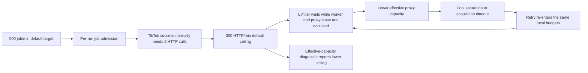
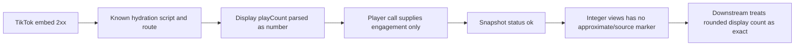
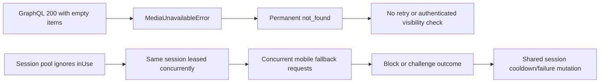

# Failure-point and fragility audit

This document is an evidence-based audit of the scraper at Git `84cd816` (2026-08-22).
It follows the current implementation from input parsing to URL preparation, admission,
proxy and session leasing, HTTP transport, platform parsing, retries, metrics, persistence,
the CLI, scheduled sessions, and dashboard consumers. Older design and issue documents are
used as historical context only; when they conflict with code or recent commits, the code
wins.

The audit is intentionally broader than a defect list. It records conditions that can turn
into failures when a platform, provider, workload, or deployment changes. It does not claim
that inferred platform/provider behavior was observed. No production code, tests,
configuration, schema, or runtime behavior was changed while producing this audit.

## Executive summary

There are **33 active findings** and **1 separately tracked historical finding**. Active
findings are counted once here, even when they also appear in a failure chain, the
silent-incorrectness register, the recovery matrix, or the Top 10.

| Active severity |  Count |
| --------------- | -----: |
| Critical        |      1 |
| High            |     17 |
| Medium          |     13 |
| Low             |      2 |
| **Total**       | **33** |

| Evidence status                       |  Count |
| ------------------------------------- | -----: |
| Current defect                        |     12 |
| Conditional fragility                 |     17 |
| Inferred risk                         |      4 |
| **Active total**                      | **33** |
| Historical/mitigated (excluded above) |      1 |

| Mitigation state    | Active count |
| ------------------- | -----------: |
| Unmitigated         |           10 |
| Partially mitigated |           23 |
| Contained           |            0 |
| **Total**           |       **33** |

The most important conclusion is evidentiary: the mocked stress suite demonstrates local
queue, proxy, retry, and persistence behavior, but the repository contains no qualifying
10-minute, 500-rpm live acceptance artifact that establishes exact metric accuracy or real
provider/platform survivability. The highest-confidence data defect is TikTok view counts:
the successful embed path uses a public display count that can be rounded, while the player
path is used only for engagement fields. The highest-confidence resource-state defect is that
the session pool can lease the same session concurrently because acquisition does not
exclude `inUse` entries.

## Scope, terminology, and counting rules

- **Domain — Platform change:** behavior coupled to undocumented endpoints, headers,
  cookies, response status/body interpretation, schema paths, or metric semantics.
- **Domain — System/infrastructure:** behavior in local admission, proxies, sessions,
  transport, retries, memory, output, observability, configuration, tests, or consumers.
- **Evidence — Current defect:** the current code demonstrably violates a stated contract,
  accepts an unusable state, loses integrity, or reports a materially misleading result.
- **Evidence — Conditional fragility:** current behavior is internally consistent but fails
  under a concrete configuration, scale, response, or lifecycle condition.
- **Evidence — Inferred risk:** the repository proves the dependency or blind spot, but the
  external platform/provider behavior needed to activate it has not been captured here.
- **Evidence — Historical/mitigated:** a dated observation remains useful, but intervening
  code changes or missing artifacts prevent treating it as a current active count.
- **Mitigation — Unmitigated:** no effective guard exists in the current path.
- **Mitigation — Partially mitigated:** detection, bounded behavior, fallback, or cleanup
  reduces the impact without removing the failure mode.
- **Mitigation — Contained:** a historical risk has an effective current boundary. No active
  finding in this audit qualifies as fully contained.

Severity reflects consequence, not likelihood. **Critical** blocks acceptance or the basis
for trusting delivery; **High** can produce incorrect data, expose origin identity, cause a
large availability/capacity failure, or corrupt durable run state; **Medium** causes bounded
availability, attribution, recovery, or operational-integrity problems; **Low** is a small
operability or documentation defect.

## Execution path and external-call inventory

```text
CLI / dev API / scheduled session
  -> config and runtime overrides
  -> input parser and URL normalizer
  -> redirect preparation and deduplication
  -> per-run job admission and capacity gate
  -> proxy lease -> session lease -> per-host HTTP limiter
  -> managed transport and proxy agent
  -> TikTok or Instagram request/parser/fallback sequence
  -> classification -> retry/backoff -> proxy/session outcome
  -> snapshot schema -> append-only JSONL
  -> metrics and summary JSON
  -> CLI watcher / session state / dashboard API and browser
```

Repository-wide call-site review found these outbound network surfaces:

| Surface              | Destination/purpose                                                            | Evidence                                                                                                                                              |
| -------------------- | ------------------------------------------------------------------------------ | ----------------------------------------------------------------------------------------------------------------------------------------------------- |
| URL preparation      | TikTok/Instagram redirects, at most five hops                                  | [TikTok resolver](../src/platforms/tiktok/tiktok-url-resolver.ts#L12), [Instagram resolver](../src/platforms/instagram/instagram-url-resolver.ts#L12) |
| TikTok scrape        | `www.tiktok.com/embed/v2/{id}` then `/player/api/v1/items`                     | [scraper constants and calls](../src/platforms/tiktok/tiktok-scraper.ts#L20)                                                                          |
| Instagram scrape     | root bootstrap, web GraphQL post/clips, optional mobile media-info fallback    | [scraper constants and workflow](../src/platforms/instagram/instagram-scraper.ts#L21)                                                                 |
| Dynamic proxy source | configured HTTP(S) proxy-list source                                           | [source implementation](../src/infrastructure/proxy/proxyscrape-source.ts#L48)                                                                        |
| Proxy validation     | HTTPS `gstatic.com/generate_204` canary                                        | [canary target](../src/infrastructure/proxy/http-canary-proxy-probe.ts#L24)                                                                           |
| Dashboard            | local run-output API; this is an internal whole-file read, not platform egress | [server route](../src/web/server/dev-api-plugin.ts#L162), [service read](../src/app/run-service.ts#L157)                                              |

The managed transport is the common boundary for scrape and redirect requests, but proxy
source fetches and low-level proxy canaries have separate measurement and error paths. A
redirect followed inside one HTTP-client call can also create more wire requests than the
logical platform-request counter suggests.

## Finding index

| ID     | Short title                                                         | Domain                | Evidence              | Severity              | Mitigation          |
| ------ | ------------------------------------------------------------------- | --------------------- | --------------------- | --------------------- | ------------------- |
| FP-001 | Historical 500-rpm proxy cascade                                    | System/infrastructure | Historical/mitigated  | Blocking (historical) | Partially mitigated |
| FP-002 | TikTok uses rounded view counts                                     | Platform change       | Current defect        | High                  | Unmitigated         |
| FP-003 | TikTok endpoints and request fingerprint are fixed                  | Platform change       | Conditional fragility | Medium                | Partially mitigated |
| FP-004 | TikTok hydration discovery is schema- and script-ID-bound           | Platform change       | Conditional fragility | High                  | Partially mitigated |
| FP-005 | TikTok engagement parsing is all-or-nothing                         | Platform change       | Conditional fragility | Medium                | Partially mitigated |
| FP-006 | TikTok unsupported states use coarse status/body heuristics         | Platform change       | Inferred risk         | Medium                | Partially mitigated |
| FP-007 | Instagram depends on undocumented document IDs and operation shapes | Platform change       | Conditional fragility | High                  | Partially mitigated |
| FP-008 | Instagram anonymous bootstrap state survives downstream rejection   | Platform change       | Conditional fragility | High                  | Partially mitigated |
| FP-009 | Instagram metric fallbacks assume semantic equivalence              | Platform change       | Inferred risk         | High                  | Unmitigated         |
| FP-010 | Instagram clips search is bounded and cached                        | Platform change       | Conditional fragility | Medium                | Partially mitigated |
| FP-011 | Instagram unavailable-media states collapse to `not_found`          | Platform change       | Conditional fragility | Medium                | Partially mitigated |
| FP-012 | Instagram authenticated fallback has a fixed mobile contract        | Platform change       | Conditional fragility | High                  | Partially mitigated |
| FP-013 | A session can be leased concurrently                                | System/infrastructure | Current defect        | High                  | Unmitigated         |
| FP-014 | Proxy leases span multi-request and limiter waits                   | System/infrastructure | Conditional fragility | High                  | Partially mitigated |
| FP-015 | Dynamic proxy candidates are retained without reconsideration       | System/infrastructure | Conditional fragility | Medium                | Partially mitigated |
| FP-016 | Residential rotation and exit identity are opaque                   | System/infrastructure | Inferred risk         | High                  | Unmitigated         |
| FP-017 | SOCKS proxies pass configuration but cannot be transported          | System/infrastructure | Current defect        | High                  | Unmitigated         |
| FP-018 | An empty static proxy pool silently permits direct origin traffic   | System/infrastructure | Conditional fragility | High                  | Partially mitigated |
| FP-019 | Admission and egress ceilings are process- and run-local            | System/infrastructure | Conditional fragility | High                  | Unmitigated         |
| FP-020 | Default job target exceeds default HTTP capacity                    | System/infrastructure | Current defect        | High                  | Partially mitigated |
| FP-021 | Retry/fan-out changes can outrun fixed limiter wait budgets         | System/infrastructure | Conditional fragility | Medium                | Partially mitigated |
| FP-022 | Rate-limiter sleeps are not abortable                               | System/infrastructure | Current defect        | Low                   | Partially mitigated |
| FP-023 | Long sessions retain unbounded histories and samples                | System/infrastructure | Conditional fragility | High                  | Partially mitigated |
| FP-024 | Per-proxy agents live until the run/session ends                    | System/infrastructure | Conditional fragility | Medium                | Partially mitigated |
| FP-025 | Dashboard output downloads read the whole JSONL file                | System/infrastructure | Current defect        | Medium                | Unmitigated         |
| FP-026 | Summaries are non-atomic and some write failures are warning-only   | System/infrastructure | Current defect        | High                  | Partially mitigated |
| FP-027 | Reusing an output path appends indistinguishable duplicate rows     | System/infrastructure | Conditional fragility | Medium                | Partially mitigated |
| FP-028 | Bandwidth totals are not provider-billed totals                     | System/infrastructure | Inferred risk         | Medium                | Partially mitigated |
| FP-029 | Snapshots retain only terminal proxy/status attribution             | System/infrastructure | Current defect        | Medium                | Partially mitigated |
| FP-030 | Metric source, source-observation time, and precision are absent    | System/infrastructure | Current defect        | High                  | Unmitigated         |
| FP-031 | Mock fixtures mirror current parsers instead of captured upstreams  | System/infrastructure | Conditional fragility | High                  | Partially mitigated |
| FP-032 | No qualifying live acceptance/accuracy evidence is retained         | System/infrastructure | Current defect        | Critical              | Unmitigated         |
| FP-033 | CLI/web overrides bypass configured upper bounds                    | System/infrastructure | Current defect        | Medium                | Partially mitigated |
| FP-034 | Operator documentation and referenced artifacts are stale           | System/infrastructure | Current defect        | Low                   | Unmitigated         |

## Historical evidence

### FP-001: A 10-proxy mock run cascaded into exhaustion at 500 rpm

- **Component:** Static proxy pool, cooldown, retry, and stress harness.
- **Failure point:** A dated acceptance-profile run depleted all ten usable leases and
  converted most failures into pool-acquisition errors.
- **Assumption:** Ten proxies with a three-failure threshold and 60-second cooldown could
  sustain a 500-rpm, ten-minute workload.
- **Trigger:** The 2026-08-21 command
  `pnpm stress-test --profile acceptance --platform tiktok` with
  `SCRAPER_CONCURRENCY=10`, ten `PROXY_POOL` entries,
  `PROXY_MAX_FAILURES=3`, `PROXY_COOLDOWN_MS=60000`,
  `PROXY_MAX_CONCURRENT=8`, `PROXY_ACQUIRE_WAIT_MS=5000`, and three attempts.
- **Current behavior:** The original report recorded 4,999 jobs in 600.15 seconds, 62.5%
  success (3,125/4,999), only 9.6 seconds continuously at at least 500 rpm, 4,060 retries,
  all ten proxies cooling, 5,713 `pool_exhausted` events, and queue depth 116. Of 1,874
  failed jobs, 1,837 were `proxy_error`. The mock's permanent-per-ID timeout distortion was
  later fixed. Current proxy generation bookkeeping, cancellation handling, effective-
  concurrency reporting, and egress pacing also changed after that run.
- **Impact:** This run failed its acceptance gate and demonstrated a self-reinforcing
  capacity cascade: fewer usable proxies raised survivor load, creating more cooldowns and
  acquisition retries.
- **Detection:** Pool-exhaustion events, proxy cooling histories, retry fraction, queue
  depth, success rate, and sustained-rate windows in a retained stress report.
- **Recovery:** Increase independently usable proxy capacity, tune failure/cooldown policy,
  rerun mock acceptance, then run the real acceptance benchmark. Do not treat a rerun with
  the same ten-proxy configuration as evidence that current defaults can sustain 500 rpm.
- **Evidence:** Historical paths were
  `output/stress-acceptance-2026-08-21T07-20-32-331Z.report.json` and
  `output/stress-2026-08-21T07-20-32-333Z.jsonl`; neither is tracked or present at this
  revision, so the numbers are preserved as dated documentary evidence, not independently
  reproducible artifacts. See [stress retry semantics](stress-testing.md#7-retryable-failures-recover-on-retry),
  current [pool acquisition](../src/infrastructure/proxy/in-memory-proxy-pool.ts#L415), and recent fixes
  [`2f39629`](https://github.com/mjfelecio/metric-scraper/commit/2f39629),
  [`911a022`](https://github.com/mjfelecio/metric-scraper/commit/911a022),
  [`f69179e`](https://github.com/mjfelecio/metric-scraper/commit/f69179e),
  [`4903193`](https://github.com/mjfelecio/metric-scraper/commit/4903193), and
  [`84cd816`](https://github.com/mjfelecio/metric-scraper/commit/84cd816).
- **Severity:** **Blocking (historical)**; excluded from current severity arithmetic.
- **Domain / evidence / mitigation:** **System/infrastructure**;
  **Historical/mitigated**; **Partially mitigated**. The exact old result is not a current
  defect claim, but the capacity shape remains possible through FP-014, FP-019, FP-020, and
  FP-021 until a current acceptance run disproves it.

## TikTok platform-change surface

| Surface               | Current contract                                                          | Unsupported/change consequence                                                           |
| --------------------- | ------------------------------------------------------------------------- | ---------------------------------------------------------------------------------------- |
| Endpoints             | Embed HTML, then player JSON                                              | Path/version removal breaks discovery or engagement enrichment                           |
| Headers               | Fixed Chrome 138 user agent; fixed player `Referer` and conversion header | Fingerprint policy changes can cause block/challenge responses                           |
| Cookies/bootstrap     | No cookie bootstrap or persistent TikTok cookie state                     | A new cookie/consent prerequisite has no modeled transition                              |
| Redirects             | Preparation follows at most five manually; scrape requests use `follow`   | Redirect loops/unsupported hosts fail preparation; internal hops are coarsely attributed |
| Status interpretation | Explicit 400/403/404/429/451 rules plus string challenge markers          | New consent, age, region, login, or soft-block responses may be misclassified            |
| Schema/embedded JSON  | Two script IDs and fixed embed route; fixed player item statistics        | Script ID, route, nesting, or numeric representation changes become parse errors         |
| Metric semantics      | Views from embed display data; engagement from player exact fields        | Rounded views can look exact; field meaning changes have no provenance check             |

### FP-002: TikTok successful rows use rounded display view counts

- **Component:** TikTok embed hydration parser and metric merge.
- **Failure point:** `views` comes from embed hydration while the exact player statistics
  request contributes likes, comments, and shares, but not views or saves.
- **Assumption:** The embed `playCount`/display value is an exact view count suitable for
  the output contract.
- **Trigger:** Any video whose public embed count has been abbreviated or rounded.
- **Current behavior:** The parser returns the embed view number and the scraper can emit
  an `ok` row with that integer. The player parser deliberately exposes only three
  engagement fields.
- **Impact:** A successful row can be numerically wrong while all health and error metrics
  remain green; comparisons and deltas can be materially distorted for popular videos.
- **Detection:** Compare the same video against a trusted exact-value surface and flag
  suspiciously round values; current output contains no precision marker.
- **Recovery:** Parse an exact count from a verified endpoint or label the value as
  approximate with source and observation timestamp; backfill affected rows if exactness is
  required.
- **Evidence:** [embed metric extraction](../src/platforms/tiktok/tiktok-hydration-parser.ts#L168),
  [player metric extraction](../src/platforms/tiktok/tiktok-player-parser.ts#L56), and the
  no-rounded-count contract in [the specification](../specification.txt#L56) and current
  [acquisition guide](acquisition-operations-note-guide.md#L40).
- **Severity:** **High**.
- **Domain / evidence / mitigation:** **Platform change**; **Current defect**;
  **Unmitigated**.

### FP-003: TikTok endpoints and request fingerprint are fixed

- **Component:** TikTok scraper transport contract.
- **Failure point:** Embed/player paths, Chrome 138 user agent, player referer, and
  `agw-js-conv` header are hard-coded.
- **Assumption:** Those public paths and headers continue to be accepted without a
  preceding cookie/consent/bootstrap exchange.
- **Trigger:** Endpoint versioning, header/fingerprint enforcement, or a newly required
  bootstrap cookie.
- **Current behavior:** Embed and player requests follow redirects and receive explicit
  HTTP classifications, but the scraper has no alternate endpoint or cookie bootstrap.
- **Impact:** TikTok acquisition can fail fleet-wide even though proxies and local capacity
  are healthy.
- **Detection:** Sudden cross-proxy 403/429/challenge or parse-error increase, separated by
  endpoint and compared with a browser capture.
- **Recovery:** Capture the new request contract, update versioned constants/headers, add
  bootstrap state if required, and replay captured fixtures before live canarying.
- **Evidence:** [constants and user agent](../src/platforms/tiktok/tiktok-scraper.ts#L16),
  [embed request](../src/platforms/tiktok/tiktok-scraper.ts#L45), and
  [player request](../src/platforms/tiktok/tiktok-scraper.ts#L124).
- **Severity:** **Medium**.
- **Domain / evidence / mitigation:** **Platform change**; **Conditional fragility**;
  **Partially mitigated** by timeouts, redirects, structured errors, and retry policy.

### FP-004: TikTok hydration discovery is schema- and script-ID-bound

- **Component:** TikTok embedded-JSON parser.
- **Failure point:** Extraction recognizes only
  `__UNIVERSAL_DATA_FOR_REHYDRATION__` and `__FRONTITY_CONNECT_STATE__`, then reads fixed
  route/state shapes including `/embed/v2/{id}`.
- **Assumption:** At least one known script ID and one known nested schema remains present.
- **Trigger:** HTML rendering changes, escaped/non-JSON script content, renamed script IDs,
  moved route state, or server-rendered markup without those payloads.
- **Current behavior:** Known schemas are tried in order and a missing/malformed result
  becomes a non-retryable parse error.
- **Impact:** A compatible video can become a permanent failure after one schema rollout;
  retry cannot recover because the error is classified non-retryable.
- **Detection:** Parser-error rate by script ID/schema, retained redacted response samples,
  and fixture replay against recent captures.
- **Recovery:** Add versioned extractors and an explicit unsupported-schema error; retain a
  safe response fingerprint/sample for rapid parser updates.
- **Evidence:** [recognized script IDs and shapes](../src/platforms/tiktok/tiktok-hydration-parser.ts#L5),
  [route lookup](../src/platforms/tiktok/tiktok-hydration-parser.ts#L150), and
  [non-retryable parse conversion](../src/platforms/tiktok/tiktok-scraper.ts#L147).
- **Severity:** **High**.
- **Domain / evidence / mitigation:** **Platform change**; **Conditional fragility**;
  **Partially mitigated** by two known hydration variants and dedicated parser tests.

### FP-005: TikTok engagement parsing is all-or-nothing

- **Component:** TikTok player parser and scraper merge.
- **Failure point:** Player extraction requires the target `id_str` under `items[]` and a
  fixed `statistics_info` object before returning any engagement metrics.
- **Assumption:** All three engagement fields retain their current names and representation
  in one item shape.
- **Trigger:** A partial response, renamed field, ID representation change, or moved
  statistics object.
- **Current behavior:** The scraper does not preserve a successful embed-only view result
  when the player schema fails; the attempt becomes a non-retryable parse failure.
- **Impact:** One enrichment schema change removes every metric for an otherwise readable
  video.
- **Detection:** Separate endpoint-success and parser-shape counters; compare embed success
  with final row status.
- **Recovery:** Model partial metric availability explicitly, version player extractors,
  and decide whether an approximate/view-only row is acceptable rather than silently
  changing that contract.
- **Evidence:** [player schema](../src/platforms/tiktok/tiktok-player-parser.ts#L5),
  [target matching and extraction](../src/platforms/tiktok/tiktok-player-parser.ts#L49), and
  [scraper parse failure](../src/platforms/tiktok/tiktok-scraper.ts#L147).
- **Severity:** **Medium**.
- **Domain / evidence / mitigation:** **Platform change**; **Conditional fragility**;
  **Partially mitigated** by explicit errors and fixtures.

### FP-006: TikTok unsupported states use coarse status/body heuristics

- **Component:** TikTok status and challenge classification.
- **Failure point:** HTTP statuses map to broad scraper states and successful bodies are
  scanned for a short list of challenge strings.
- **Assumption:** 400 means private, 404 means not found, current 403/429 distinctions are
  stable, and consent/login/age/region/challenge bodies include known markers.
- **Trigger:** A new soft-block, consent, unsupported-media, age gate, region gate, or a 200
  challenge with different text.
- **Current behavior:** Known 400/403/404/429/451 cases are classified; unknown statuses and
  parser failures use generic errors. Preparation has its own similar but not identical
  mapping.
- **Impact:** Retries, proxy health, and user-facing status can be wrong; permanent content
  may be retried or a transient/platform block may be treated as permanent.
- **Detection:** Preserve status plus a redacted body fingerprint and compare preparation,
  embed, and player classifications for the same URL.
- **Recovery:** Add explicit states based on captured responses and keep classification
  policy shared/versioned across resolver and scraper.
- **Evidence:** [embed status rules](../src/platforms/tiktok/tiktok-scraper.ts#L65),
  [challenge markers](../src/platforms/tiktok/tiktok-scraper.ts#L224), and
  [resolver rules](../src/platforms/tiktok/tiktok-url-resolver.ts#L86).
- **Severity:** **Medium**.
- **Domain / evidence / mitigation:** **Platform change**; **Inferred risk**;
  **Partially mitigated** by explicit known-state mappings and permanent/retryable errors.

## Instagram platform-change surface

| Surface               | Current contract                                                              | Unsupported/change consequence                                           |
| --------------------- | ----------------------------------------------------------------------------- | ------------------------------------------------------------------------ |
| Endpoints             | Root bootstrap, web GraphQL post/clips, optional mobile media-info            | Endpoint/document version changes break acquisition/fallback             |
| Headers               | Fixed Chrome 142 web identity and fixed mobile app identity/claim             | Fingerprint or app-ID policy changes can reject otherwise valid sessions |
| Cookies/bootstrap     | Anonymous CSRF/cookie parsed from root and cached per proxy/direct key        | Cookie layout, expiry, or invalidation changes can poison later calls    |
| Redirects             | Resolver limits five manual hops; GraphQL/mobile manually interpret redirects | New login/consent redirect destinations can be classified coarsely       |
| Status interpretation | Explicit 401/403/404/429/451 and login redirect rules                         | Deleted/private/unsupported/auth-required states can collapse together   |
| Schema/embedded JSON  | Fixed GraphQL operation names and nested response paths                       | Document or response schema rollout produces parse/unavailable failures  |
| Metric semantics      | First non-null play/view and share/reshare fields wins                        | Different concepts can be emitted under one metric name                  |
| Pagination            | At most configured authors/pages; per-run successful page cache               | Exact views can be missed or observed at different times                 |

### FP-007: Instagram depends on undocumented document IDs and operation shapes

- **Component:** Instagram web GraphQL post and clips requests/parsers.
- **Failure point:** Default document IDs, operation names, variables, headers, and nested
  response paths are fixed in code/config.
- **Assumption:** Instagram continues accepting those undocumented web operations and
  returning the same `xdt_*` response shapes.
- **Trigger:** Document-ID invalidation, operation rename, required-variable/header change,
  or response nesting change.
- **Current behavior:** HTTP failures are classified and some requests retry; a successful
  response with an unexpected shape becomes a non-retryable parse/unavailable result.
- **Impact:** Anonymous Instagram scraping can fail globally, forcing authenticated
  fallback where configured or losing exact video views altogether.
- **Detection:** Endpoint-specific status/parser counters and a live low-rate canary that
  validates known metrics, not merely HTTP 2xx.
- **Recovery:** Refresh document IDs and schemas from a verified client flow, make their
  version/effective date observable, and update captured contract fixtures.
- **Evidence:** [default document IDs](../src/platforms/instagram/instagram-scraper.ts#L49),
  [post request variables](../src/platforms/instagram/instagram-scraper.ts#L278),
  [post operation shape](../src/platforms/instagram/instagram-post-parser.ts#L14), and
  [clips operation shape](../src/platforms/instagram/instagram-clips-parser.ts#L5).
- **Severity:** **High**.
- **Domain / evidence / mitigation:** **Platform change**; **Conditional fragility**;
  **Partially mitigated** by configurable document IDs, explicit errors, and authenticated
  fallback.

### FP-008: Instagram anonymous bootstrap state survives downstream rejection

- **Component:** Anonymous cookie/CSRF bootstrap cache.
- **Failure point:** A bootstrap promise is cached per proxy/direct key and removed only if
  bootstrap itself rejects; later GraphQL authentication/block/cookie rejection does not
  invalidate it.
- **Assumption:** A successfully parsed cookie/CSRF pair remains valid for the entire run
  and for every later request on that proxy identity.
- **Trigger:** Cookie expiry, server invalidation, proxy exit change behind one proxy ID,
  consent transition, or downstream rejection of syntactically valid bootstrap state.
- **Current behavior:** Subsequent attempts reuse the same cached state and can repeat the
  same failure until the run ends.
- **Impact:** Retry amplification and prolonged Instagram outage for one or more proxy keys;
  residential rotation makes the identity assumption especially uncertain.
- **Detection:** Correlate downstream 401/403/redirect responses with bootstrap age/key and
  compare recovery after explicit cache eviction.
- **Recovery:** Expire state, invalidate it on authentication/challenge responses, and bind
  it to an observable exit/session identity where possible.
- **Evidence:** [anonymous-state map and workflow](../src/platforms/instagram/instagram-scraper.ts#L53),
  [cache retention rule](../src/platforms/instagram/instagram-scraper.ts#L221), and
  [bootstrap cookie/CSRF parsing](../src/platforms/instagram/instagram-scraper.ts#L235).
- **Severity:** **High**.
- **Domain / evidence / mitigation:** **Platform change**; **Conditional fragility**;
  **Partially mitigated** because bootstrap rejection itself evicts the promise and cache
  lifetime is bounded to the runner.

### FP-009: Instagram metric fallbacks assume semantic equivalence

- **Component:** Instagram post and authenticated media-info parsers.
- **Failure point:** The first non-null of `play_count`, `view_count`, and
  `video_view_count` becomes `views`; similarly `reshare_count` and `share_count` become
  `shares`.
- **Assumption:** All fallback fields are interchangeable measures across media types and
  API surfaces.
- **Trigger:** Instagram changes field definitions or returns multiple non-null fields with
  different meanings/populations.
- **Current behavior:** The first available number is emitted as a successful canonical
  metric without recording the source field.
- **Impact:** Plausible, internally valid numbers can be semantically wrong and cannot be
  audited after persistence.
- **Detection:** Capture source field and simultaneous candidates, compare definitions and
  known examples, and alert on disagreement.
- **Recovery:** Define per-media/per-surface precedence based on verified semantics and
  persist source plus observation timestamp.
- **Evidence:** [post fallback order](../src/platforms/instagram/instagram-post-parser.ts#L68),
  [first-non-null helper](../src/platforms/instagram/instagram-post-parser.ts#L105), and
  [media-info fallback order](../src/platforms/instagram/instagram-media-info-parser.ts#L45).
- **Severity:** **High**.
- **Domain / evidence / mitigation:** **Platform change**; **Inferred risk**;
  **Unmitigated**. The code proves the semantic assumption; this repository does not contain
  upstream documentation or live captures proving equivalence.

### FP-010: Instagram clips search is bounded and cached

- **Component:** Exact-view discovery through author clips pagination.
- **Failure point:** Only a configured prefix of authors and pages is searched, and
  successful clips pages are cached per proxy/author/cursor for the run.
- **Assumption:** The target appears within those pages and a cached page remains an
  appropriate observation for later URLs.
- **Trigger:** Older/high-volume author feeds, ordering changes, cross-post attribution,
  low author/page limits, or metrics changing after a page was cached.
- **Current behavior:** Defaults search three authors and two pages. A matching `play_count`
  succeeds; otherwise the scraper uses authenticated fallback or returns `session_error`.
- **Impact:** Exact views can be unavailable despite existing deeper in pagination, and a
  successful count can be older than the row that consumes the cached page.
- **Detection:** Record searched authors/pages/cursors, cache age, match location, and the
  reason pagination stopped.
- **Recovery:** Make depth an explicit accuracy/cost policy, refresh or timestamp cached
  pages, and use a direct exact-count surface when verified.
- **Evidence:** [defaults and workflow](../src/platforms/instagram/instagram-scraper.ts#L49),
  [bounded loops](../src/platforms/instagram/instagram-scraper.ts#L107), and
  [clips-page cache](../src/platforms/instagram/instagram-scraper.ts#L297).
- **Severity:** **Medium**.
- **Domain / evidence / mitigation:** **Platform change**; **Conditional fragility**;
  **Partially mitigated** by explicit limits and authenticated fallback.

### FP-011: Instagram unavailable-media states collapse to `not_found`

- **Component:** Instagram GraphQL post parser and error conversion.
- **Failure point:** An empty GraphQL media-item collection raises `MediaUnavailableError`,
  which the scraper converts to permanent `not_found`.
- **Assumption:** Empty means deleted/nonexistent rather than private, age/region gated,
  login-required, unsupported media, transient experiment, or stale document ID.
- **Trigger:** Any supported media that returns HTTP 200 with an empty item collection for
  another reason.
- **Current behavior:** Commit
  [`0559456`](https://github.com/mjfelecio/metric-scraper/commit/0559456) made the state
  explicit, but the resulting classification is still permanent and non-retryable.
- **Impact:** Valid media can be mislabeled `not_found`, skipped on retry, and counted as a
  content outcome rather than a platform/authentication regression.
- **Detection:** Preserve a safe response-shape fingerprint and compare anonymous versus
  authenticated/browser visibility before assigning a permanent state.
- **Recovery:** Split deleted, private, authentication-required, unsupported, and unknown-
  unavailable classifications using captured evidence; keep unknown cases retryable or
  quarantined.
- **Evidence:** [empty-item exception](../src/platforms/instagram/instagram-post-parser.ts#L47)
  and [conversion to `not_found`](../src/platforms/instagram/instagram-scraper.ts#L462).
- **Severity:** **Medium**.
- **Domain / evidence / mitigation:** **Platform change**; **Conditional fragility**;
  **Partially mitigated** by a typed exception and tests, but not by finer classification.

### FP-012: Instagram authenticated fallback has a fixed mobile contract

- **Component:** Authenticated media-info fallback and session integration.
- **Failure point:** The mobile URL, app ID, user agent, claim, cookie layout, and session
  headers are fixed; session headers are spread after defaults and can override them.
- **Assumption:** Stored cookies/headers are fresh, compatible with that mobile API identity,
  and valid on the same logical proxy/exit.
- **Trigger:** Mobile API changes, expired/challenged sessions, conflicting stored headers,
  or a provider that changes exit IP behind one lease ID.
- **Current behavior:** The request uses the current proxy and manual redirects. Failures
  become classified scrape/session outcomes, but there is no reauthentication flow.
- **Impact:** The last exact-view fallback can fail broadly and can cool or block valuable
  sessions.
- **Detection:** Session-specific status/challenge rate, header-contract version, cookie age,
  and same-exit verification.
- **Recovery:** Validate and refresh session material out of band, version the mobile
  contract, prevent unsafe header overrides, and bind sessions to stable exits.
- **Evidence:** [fallback request contract](../src/platforms/instagram/instagram-scraper.ts#L165)
  and [session matching in the runner](../src/core/runner/scrape-runner.ts#L448).
- **Severity:** **High**.
- **Domain / evidence / mitigation:** **Platform change**; **Conditional fragility**;
  **Partially mitigated** by optionality, session cooldown, redirects, and structured errors.

## Proxy infrastructure and session lifecycle

### FP-013: A session can be leased concurrently

- **Component:** Session pool.
- **Failure point:** Acquisition filters by platform, proxy ID, and cooldown usability but
  does not exclude entries whose `inUse` flag is already true.
- **Assumption:** Setting `inUse` after selection prevents another worker from selecting the
  same entry.
- **Trigger:** Two concurrent jobs needing the same platform/proxy combination while that
  session remains otherwise usable.
- **Current behavior:** Both acquisitions can return the same session; release/outcome from
  one job mutates shared cooldown/failure state while the other is still using it.
- **Impact:** Concurrent cookie use, provider/platform anomaly detection, inconsistent
  cooldown accounting, and cascading authenticated fallback failures.
- **Detection:** Assert lease uniqueness by session ID and expose concurrent-lease gauges;
  no existing test covers simultaneous acquisition.
- **Recovery:** Require `!entry.inUse` during selection, define wait/no-session behavior,
  reject duplicate session IDs at load, and add a concurrency regression test.
- **Evidence:** [`inUse` state](../src/infrastructure/session/in-memory-session-pool.ts#L25),
  [selection and assignment](../src/infrastructure/session/in-memory-session-pool.ts#L67), and current
  [session-pool tests](../tests/session/session-pool.test.ts#L1).
- **Severity:** **High**.
- **Domain / evidence / mitigation:** **System/infrastructure**; **Current defect**;
  **Unmitigated**.

### FP-014: Proxy leases span multi-request and limiter waits

- **Component:** Runner attempt lifecycle and proxy pool capacity.
- **Failure point:** A proxy is acquired before session selection and the per-host egress
  limiter; it remains leased through a platform workflow that may include bootstrap,
  GraphQL/pagination/player calls, redirects, and limiter waits.
- **Assumption:** `PROXY_MAX_CONCURRENT` represents useful request capacity even when one job
  holds a lease while not on the wire.
- **Trigger:** Low HTTP ceilings, multi-hop Instagram/TikTok workflows, limiter contention,
  slow responses, or saturated pools.
- **Current behavior:** The lease is released after the attempt outcome, before inter-attempt
  retry backoff. Saturated pools wait up to the configured acquisition window and then emit
  retryable `proxy_error`.
- **Impact:** Effective proxy throughput can be much lower than configured and can recreate
  a pool-exhaustion/retry cascade.
- **Detection:** Measure lease hold time versus wire time and limiter wait, plus saturation
  and `pool_exhausted` events.
- **Recovery:** Size capacity from measured lease duration/fan-out, avoid holding scarce
  leases during unrelated waits where identity semantics permit, and use admission
  backpressure before acquisition.
- **Evidence:** [runner acquisition and limiter ordering](../src/core/runner/scrape-runner.ts#L448),
  [release/retry boundary](../src/core/runner/scrape-runner.ts#L498), and
  [pool saturation wait](../src/infrastructure/proxy/in-memory-proxy-pool.ts#L415).
- **Severity:** **High**.
- **Domain / evidence / mitigation:** **System/infrastructure**;
  **Conditional fragility**; **Partially mitigated** by bounded acquisition wait, release
  before retry backoff, and capacity-aware admission.

### FP-015: Dynamic proxy candidates are retained without reconsideration

- **Component:** Proxy source candidate manager.
- **Failure point:** Candidate and pending maps retain up to 5,000 entries; rejected
  candidates are refreshed as existing records rather than revalidated, and once the cap
  is reached later new candidates are ignored.
- **Assumption:** Early candidates remain representative and a previously rejected endpoint
  never becomes useful.
- **Trigger:** Long-lived sessions, source churn, temporarily dead proxies recovering, or
  stale early candidates filling the cap.
- **Current behavior:** Memory is capped, but selection quality can freeze around the first
  candidate population.
- **Impact:** Usable capacity decays or fails to recover even while the source supplies
  fresher proxies.
- **Detection:** Candidate age/state distribution, cap-hit counter, ignored-new-candidate
  counter, and periodic validation yield.
- **Recovery:** Add TTL/eviction and bounded revalidation of rejected candidates; prefer
  recent source generations when at capacity.
- **Evidence:** [candidate state and cap](../src/infrastructure/proxy/proxy-source-manager.ts#L112) and
  [registration behavior](../src/infrastructure/proxy/proxy-source-manager.ts#L337).
- **Severity:** **Medium**.
- **Domain / evidence / mitigation:** **System/infrastructure**;
  **Conditional fragility**; **Partially mitigated** by the 5,000-entry memory bound and
  generation-aware pool state.

### FP-016: Residential rotation and exit identity are opaque

- **Component:** Rotating residential proxy provider.
- **Failure point:** The provider exposes one synthetic stable gateway lease, no exit-IP
  observation, no per-exit roster/cooldown/capacity, and no enforcement that failures cause
  a new exit.
- **Assumption:** The upstream provider rotates identity as expected on each request while
  preserving any cookie/session affinity the platform needs.
- **Trigger:** Sticky provider behavior, a shared bad exit, region mismatch, provider-side
  throttling, or a platform binding cookies to IP.
- **Current behavior:** Every acquisition returns the same gateway identity; failures are
  counted but do not change eligibility. Stats cannot distinguish exits.
- **Impact:** Repeated blocking can masquerade as rotation, session/IP affinity can break,
  and capacity/health attribution can be materially wrong.
- **Detection:** Obtain provider-supported exit-IP/rotation metadata or perform a controlled
  identity probe outside the measured scrape path; compare it with gateway and session IDs.
- **Recovery:** Integrate an explicit rotation/sticky-session contract and per-exit identity
  where the provider supports it; otherwise label capacity/health as gateway-level only.
- **Evidence:** [single lease and acquisition](../src/infrastructure/proxy/rotating-residential-proxy-provider.ts#L24)
  and [synthetic capacity/stats](../src/infrastructure/proxy/rotating-residential-proxy-provider.ts#L116).
- **Severity:** **High**.
- **Domain / evidence / mitigation:** **System/infrastructure**; **Inferred risk**;
  **Unmitigated**. No live provider artifact in the repository proves or disproves rotation.

### FP-017: SOCKS proxies pass configuration but cannot be transported

- **Component:** Proxy configuration, pool, canary, and managed transport.
- **Failure point:** Configuration accepts `socks4` and `socks5`, while the transport agent
  factory rejects every scheme except HTTP and HTTPS.
- **Assumption:** Every accepted proxy protocol is usable by the scrape transport.
- **Trigger:** A configured static or sourced SOCKS proxy is selected for a request.
- **Current behavior:** Agent construction throws before the fetch error boundary; the
  runner sees a generic non-retryable error, and normal proxy-failure/cooldown handling does
  not reliably identify the candidate as unusable.
- **Impact:** Jobs fail despite configuration validation, candidates can remain eligible,
  and operators may mistake a product limitation for platform instability.
- **Detection:** Startup transport-capability validation and an end-to-end request test for
  each accepted scheme.
- **Recovery:** Either implement SOCKS transport/canary support or reject SOCKS at
  configuration parsing with an actionable error.
- **Evidence:** [accepted schemes](../src/infrastructure/proxy/proxy-config.ts#L4),
  [transport rejection](../src/app/composition.ts#L118),
  [agent factory constraint](../src/app/composition.ts#L404), and the documented
  [known limitation](../README.md#L277).
- **Severity:** **High**.
- **Domain / evidence / mitigation:** **System/infrastructure**; **Current defect**;
  **Unmitigated**.

### FP-018: An empty static proxy pool silently permits direct origin traffic

- **Component:** Composition and static proxy-pool fallback.
- **Failure point:** If the static proxy configuration produces no entries, composition
  uses a null pool/direct transport unless proxy use is explicitly required.
- **Assumption:** Empty means intentional direct mode rather than a missing secret,
  formatting error, or failed injection.
- **Trigger:** Deployment starts with an unexpectedly empty static `PROXY_POOL` and without
  the dynamic-source `requireProxy` guard.
- **Current behavior:** Jobs proceed from the machine's origin IP. Dynamic-source mode has
  an explicit guard against origin fallback.
- **Impact:** Origin identity exposure, platform blocking, and traffic that violates the
  operator's proxy-only intent.
- **Detection:** Startup mode banner, effective proxy count, and a proxy-required invariant
  in production configuration.
- **Recovery:** Add an explicit direct-mode opt-in/proxy-required setting for all modes and
  fail closed when the effective pool is empty.
- **Evidence:** [static null-pool composition](../src/app/composition.ts#L579) and
  [dynamic-source guard](../src/app/composition.ts#L607).
- **Severity:** **High**.
- **Domain / evidence / mitigation:** **System/infrastructure**;
  **Conditional fragility**; **Partially mitigated** by explicit reporting and the dynamic
  source's fail-closed behavior.

## Concurrency, rate limiting, and retries

### FP-019: Admission and egress ceilings are process- and run-local

- **Component:** Runner/job token bucket, per-host HTTP limiter, web run service, and
  deployment topology.
- **Failure point:** Every built runner owns new job and per-host token buckets. Multiple
  runs in one process and multiple processes do not share a global budget.
- **Assumption:** Only one run/process targets each platform/identity at a time.
- **Trigger:** Concurrent dashboard runs, an overlapping scheduled session, multiple CLI
  processes, or horizontal replicas.
- **Current behavior:** Each run can independently admit its configured rpm and egress
  ceiling; the run service allows multiple active runs.
- **Impact:** Aggregate traffic, retry volume, proxy demand, and platform/provider limits can
  be multiplied beyond operator expectations.
- **Detection:** Aggregate request counters keyed by deployment/platform/host/provider, not
  only per run.
- **Recovery:** Centralize budgets or explicitly partition them among active runs/processes;
  reject/queue conflicting runs when a shared ceiling is required.
- **Evidence:** [per-run construction](../src/app/composition.ts#L251),
  [per-run admission](../src/core/runner/scrape-runner.ts#L141),
  [per-client host limiter](../src/infrastructure/http/rate-limited-http-client.ts#L64), and
  [run service state](../src/app/run-service.ts#L50).
- **Severity:** **High**.
- **Domain / evidence / mitigation:** **System/infrastructure**;
  **Conditional fragility**; **Unmitigated** across runs/processes.

### FP-020: Default job target exceeds default HTTP capacity

- **Component:** Rate configuration and capacity diagnostics.
- **Failure point:** Default target is 500 jobs/minute, while TikTok HTTP egress defaults to
  300/minute and Instagram to 180/minute. A normal TikTok success uses two requests; an
  Instagram path uses bootstrap/GraphQL and sometimes pagination/fallback.
- **Assumption:** Job rpm and HTTP rpm are comparable despite endpoint fan-out.
- **Trigger:** Running defaults against normal successful traffic.
- **Current behavior:** The HTTP limiter correctly paces instead of killing requests after
  [`84cd816`](https://github.com/mjfelecio/metric-scraper/commit/84cd816), but the configured
  target is not achievable: steady TikTok capacity is about 150 successful jobs/minute at
  two requests each, and Instagram can be lower depending on cache/fallback paths.
- **Impact:** Acceptance targets are missed by construction; queue/lease pressure and run
  duration grow even with a healthy upstream.
- **Detection:** Effective-concurrency diagnostics already report the fan-out-adjusted HTTP
  ceiling; compare achieved rpm with that ceiling before blaming proxies/platforms.
- **Recovery:** Set job targets from verified request fan-out and shared egress budget, or
  deliberately raise HTTP ceilings within a validated platform/provider envelope.
- **Evidence:** [configuration defaults](../src/config/env.ts#L238),
  [fan-out capacity calculation](../src/core/concurrency/concurrency-diagnostics.ts#L127),
  [TikTok two-call flow](../src/platforms/tiktok/tiktok-scraper.ts#L45), and
  [example configuration notes](../.env.example#L18).
- **Severity:** **High**.
- **Domain / evidence / mitigation:** **System/infrastructure**; **Current defect**;
  **Partially mitigated** by diagnostics and bounded egress waiting.

### FP-021: Retry/fan-out changes can outrun fixed limiter wait budgets

- **Component:** Per-host HTTP limiter, platform workflows, and retry policy.
- **Failure point:** Maximum limiter wait is configured in milliseconds while actual demand
  depends on runtime endpoint fan-out, redirects, retries, bootstrap cache misses, and
  pagination.
- **Assumption:** Static wait budgets remain sufficient for every enabled workflow and load
  mix.
- **Trigger:** Higher retry rate, Instagram fallback/pagination, redirect growth, concurrent
  runs, or a lower rpm override without a corresponding wait increase.
- **Current behavior:** The limiter waits only up to its platform budget and then emits a
  retryable rate-limit wait error. Retries can re-enter the same constrained budget.
- **Impact:** Local admission pressure can amplify into retry traffic and proxy lease
  pressure, resembling an upstream rate limit.
- **Detection:** Separate local limiter timeout/wait duration from upstream 429 and report
  requests-per-job distribution.
- **Recovery:** Derive wait/admission from measured fan-out and queue position; prevent
  retries caused solely by a predictably saturated local budget.
- **Evidence:** [bounded acquire](../src/infrastructure/http/rate-limited-http-client.ts#L81),
  [runner retry boundary](../src/core/runner/scrape-runner.ts#L498), and commits
  [`4903193`](https://github.com/mjfelecio/metric-scraper/commit/4903193) and
  [`84cd816`](https://github.com/mjfelecio/metric-scraper/commit/84cd816).
- **Severity:** **Medium**.
- **Domain / evidence / mitigation:** **System/infrastructure**;
  **Conditional fragility**; **Partially mitigated** by bounded waits, jittered retries, and
  capacity diagnostics.

### FP-022: Rate-limiter sleeps are not abortable

- **Component:** Token bucket cancellation.
- **Failure point:** The limiter checks `AbortSignal` between sleeps, but its sleep promise
  itself has no signal.
- **Assumption:** Waiting until the next refill interval is an acceptable cancellation
  latency.
- **Trigger:** Stop/cancel while a waiter is sleeping, especially at a very low rpm.
- **Current behavior:** Cancellation is observed only after the current sleep completes and
  the loop resumes.
- **Impact:** Shutdown or run cancellation can lag by up to roughly one token interval.
- **Detection:** Cancellation-latency test at the minimum configured rate.
- **Recovery:** Use an abortable timer and remove aborted waiters without breaking the
  serialized acquisition chain.
- **Evidence:** [serialized acquisition and sleep loop](../src/core/rate-limit/rate-limit.ts#L63).
- **Severity:** **Low**.
- **Domain / evidence / mitigation:** **System/infrastructure**; **Current defect**;
  **Partially mitigated** by checks before/after sleep and bounded rate configuration.

## Queue, memory, and resource lifetime

### FP-023: Long sessions retain unbounded histories and samples

- **Component:** Input preparation, run metrics, and scheduled session state.
- **Failure point:** Inputs/resolution results are materialized, run collectors retain every
  latency/queue sample until summary, and scheduled sessions append every cycle and latency
  for their lifetime.
- **Assumption:** Runs and sessions remain small/short enough for linear retained memory.
- **Trigger:** Large inputs, high-volume runs, `--watch` sessions with many cycles, or an
  indefinitely running dashboard session.
- **Current behavior:** Some structures are bounded (throughput timeline 2,000 points,
  recent results 50, web runs 20), but latency arrays and session `cycles`/metric series
  continue to grow.
- **Impact:** Heap growth, longer percentile sorts/serialization, dashboard payload growth,
  and eventual process instability.
- **Detection:** Retained heap and collection length by run/session age; load tests spanning
  the intended maximum session duration.
- **Recovery:** Stream inputs where practical, replace exact percentile samples with bounded
  sketches/reservoirs, and cap/roll up session cycles and series.
- **Evidence:** [whole-file input load](../src/infrastructure/input/file-input-loader.ts#L19),
  [input materialization](../src/core/input/parse-input.ts#L36),
  [resolution arrays/cache](../src/app/input-preparer.ts#L65),
  [metrics samples](../src/core/metrics/metrics-collector.ts#L187),
  [session histories](../src/app/scrape-session.ts#L226), and bounded
  [throughput timeline](../src/core/metrics/throughput-timeline.ts#L68).
- **Severity:** **High**.
- **Domain / evidence / mitigation:** **System/infrastructure**;
  **Conditional fragility**; **Partially mitigated** by bounded queues/timelines/recent views
  and end-of-run cleanup.

### FP-024: Per-proxy agents live until the run/session ends

- **Component:** Managed Undici HTTP transport.
- **Failure point:** A proxy agent is cached by complete proxy target URL and never evicted
  during a runner's lifetime.
- **Assumption:** The set of proxy target URLs remains bounded and useful for the full run or
  scheduled session.
- **Trigger:** A dynamic source with sustained proxy churn or credentialized URLs that vary
  frequently.
- **Current behavior:** Every distinct target can add an agent/connection pool; all agents
  are closed together only when the transport closes.
- **Impact:** File descriptors, sockets, timers, and heap can grow during long sessions even
  after candidates become irrelevant.
- **Detection:** Agent-map size, open sockets/descriptors, last-used time, and candidate
  churn.
- **Recovery:** Add idle/LRU eviction and close agents when candidates are permanently
  removed, while preserving reuse for active identities.
- **Evidence:** [agent cache and creation](../src/app/composition.ts#L95) and
  [end-of-life close](../src/app/composition.ts#L149).
- **Severity:** **Medium**.
- **Domain / evidence / mitigation:** **System/infrastructure**;
  **Conditional fragility**; **Partially mitigated** by reuse and deterministic final close.

### FP-025: Dashboard output downloads read the whole JSONL file

- **Component:** Web run service and development server output endpoint.
- **Failure point:** `readOutput` uses `readFile(..., 'utf8')`, then the server sends the
  complete string.
- **Assumption:** Every result file fits comfortably in memory and HTTP response buffers.
- **Trigger:** Large input/run output or repeated downloads during a long run/session.
- **Current behavior:** The entire JSONL is duplicated into process memory rather than
  streamed or ranged.
- **Impact:** Memory spikes, event-loop pressure, slow dashboard response, and potential
  process failure on the same service managing active runs.
- **Detection:** Output file size, download duration, heap delta, and concurrent download
  count.
- **Recovery:** Stream the file with backpressure, support range/pagination, and impose a
  documented maximum download size.
- **Evidence:** [whole-file service read](../src/app/run-service.ts#L157) and
  [response route](../src/web/server/dev-api-plugin.ts#L162).
- **Severity:** **Medium**.
- **Domain / evidence / mitigation:** **System/infrastructure**; **Current defect**;
  **Unmitigated**.

## Output and persistence

### FP-026: Summaries are non-atomic and some write failures are warning-only

- **Component:** CLI/run/session summary persistence.
- **Failure point:** Summary JSON is written directly to its final path without temp-file
  plus rename; the web run service and scheduled session warn and continue if summary
  persistence fails.
- **Assumption:** A single `writeFile` cannot leave a truncated/old/missing summary and a
  warning is sufficient for a durable run artifact.
- **Trigger:** Process crash, disk full, permission/transient filesystem failure, or a
  consumer reading during replacement.
- **Current behavior:** JSONL snapshot write failure aborts the run, but summary durability
  has a weaker contract depending on the entry point.
- **Impact:** A run can be reported finished while its durable summary is missing, corrupt,
  or inconsistent with the JSONL.
- **Detection:** Atomic parse/read-after-write verification, summary/row reconciliation, and
  a durable completion state only after persistence succeeds.
- **Recovery:** Write/fsync a temporary sibling and atomically rename; make persistence
  failure explicit in run/session status and support summary reconstruction from JSONL.
- **Evidence:** [direct run-summary write](../src/infrastructure/output/run-paths.ts#L43),
  [direct session-summary write](../src/infrastructure/output/run-paths.ts#L103),
  [run-service warning](../src/app/run-service.ts#L642), and
  [session warning](../src/app/scrape-session.ts#L602).
- **Severity:** **High**.
- **Domain / evidence / mitigation:** **System/infrastructure**; **Current defect**;
  **Partially mitigated** by validated/backpressured JSONL writes and surfaced warnings.

### FP-027: Reusing an output path appends indistinguishable duplicate rows

- **Component:** JSONL sink and snapshot schema.
- **Failure point:** The sink intentionally opens with append mode, while snapshots contain
  no run ID or idempotency key.
- **Assumption:** A selected output path is new, or downstream consumers can infer run
  boundaries externally.
- **Trigger:** Rerun/resume with the same explicit output path, concurrent writers, or an
  operator expecting overwrite behavior.
- **Current behavior:** New valid rows append after old valid rows and are indistinguishable
  by run provenance.
- **Impact:** Duplicate observations, inflated counts, mixed configurations/time windows,
  and unsafe downstream deduplication.
- **Detection:** Refuse nonempty destinations unless append is explicit; inspect path/run
  manifest and duplicate platform/ID/timestamp combinations.
- **Recovery:** Generate unique paths by default, persist a run ID/config hash per row or in
  a framed manifest, and implement explicit resume semantics.
- **Evidence:** [append-mode sink](../src/infrastructure/output/jsonl-file-sink.ts#L81) and
  [snapshot schema](../src/core/models/snapshot.ts#L29).
- **Severity:** **Medium**.
- **Domain / evidence / mitigation:** **System/infrastructure**;
  **Conditional fragility**; **Partially mitigated** by timestamped default paths and schema
  validation.

## Observability and attribution

### FP-028: Bandwidth totals are not provider-billed totals

- **Component:** Counting dispatcher and bandwidth reporting.
- **Failure point:** Measurement covers observable request/status headers and bodies at the
  dispatcher boundary, not all DNS, TCP, TLS, proxy CONNECT, framing, canary, proxy-source,
  retransmission, or provider-accounting bytes.
- **Assumption:** Instrumented application bytes approximate the provider's billable
  traffic closely enough for budgeting.
- **Trigger:** Provider billing includes tunnel/TLS overhead, canaries/source traffic, or
  uses a materially different accounting layer.
- **Current behavior:** Reports precise-looking byte totals and per-proxy gateway
  attribution within the documented measurement boundary.
- **Impact:** Cost forecasts and proxy comparisons can be systematically low or
  misattributed, especially for rotating gateways.
- **Detection:** Reconcile a controlled run against provider invoices/telemetry and label
  unexplained overhead.
- **Recovery:** Keep application and provider-billed metrics separate, publish measurement
  boundaries next to totals, and integrate provider telemetry where available.
- **Evidence:** [bandwidth design limitations](superpowers/specs/2026-08-20-bandwidth-instrumentation-design.md#6-known-limits)
  and [counting dispatcher](../src/infrastructure/http/counting-dispatcher.ts#L1).
- **Severity:** **Medium**.
- **Domain / evidence / mitigation:** **System/infrastructure**; **Inferred risk**;
  **Partially mitigated** because the design documents exclusions and reports logical HTTP
  request counts separately.

### FP-029: Snapshots retain only terminal proxy/status attribution

- **Component:** Retry diagnostics and snapshot output.
- **Failure point:** A final row stores terminal proxy ID and last HTTP status, while earlier
  attempts, redirect hops, endpoint statuses, and proxy IDs remain aggregated only in run
  metrics/events.
- **Assumption:** The terminal attempt adequately explains a multi-attempt result.
- **Trigger:** Proxy rotation between retries, multi-endpoint workflows, redirects, or a
  final success after earlier blocks.
- **Current behavior:** Attempts/retry count is visible, but row-level causal attribution is
  incomplete. The separate proxy transition log is fire-and-forget and deliberately becomes
  disabled rather than failing the run after an asynchronous write error.
- **Impact:** Operators can blame/credit the wrong proxy or endpoint and cannot reconstruct
  the path for a specific observation.
- **Detection:** Compare proxy-event logs and aggregate endpoint metrics with terminal rows;
  mismatches cannot always be joined today.
- **Recovery:** Add bounded per-attempt diagnostic events/correlation IDs or a separate
  attempt log, with sensitive proxy/session data appropriately redacted.
- **Evidence:** [snapshot fields](../src/core/models/snapshot.ts#L29),
  [terminal diagnostic construction](../src/core/runner/scrape-runner.ts#L554),
  [non-fatal proxy event log](../src/infrastructure/output/proxy-event-log.ts#L23), and
  [stress-report interpretation limits](stress-testing.md#10-telemetry-cross-check).
- **Severity:** **Medium**.
- **Domain / evidence / mitigation:** **System/infrastructure**; **Current defect**;
  **Partially mitigated** by attempt/retry counts, terminal attribution, proxy event logs,
  and aggregate platform-request metrics.

### FP-030: Metric source, source-observation time, and precision are absent

- **Component:** Canonical metric/snapshot schema.
- **Failure point:** Persisted metrics do not identify embed/player/GraphQL/clips/mobile
  source fields, approximate versus exact precision, or source observation time/cache age.
- **Assumption:** A canonical integer has the same semantics and freshness regardless of
  acquisition path.
- **Trigger:** TikTok rounded views, Instagram fallback fields, clips cache reuse, or a
  fallback-path change.
- **Current behavior:** A row can be schema-valid and `ok` while downstream consumers cannot
  distinguish approximate, cached, or fallback-derived values.
- **Impact:** Silent incorrectness cannot be audited, confidence-filtered, or safely
  backfilled.
- **Detection:** Not possible from current rows alone; requires comparison with logs/live
  sources.
- **Recovery:** Add per-metric provenance, source field/surface, observation time, and
  precision/confidence to a versioned output contract.
- **Evidence:** [snapshot schema](../src/core/models/snapshot.ts#L29),
  [TikTok merge](../src/platforms/tiktok/tiktok-scraper.ts#L124), and
  [Instagram workflow](../src/platforms/instagram/instagram-scraper.ts#L79).
- **Severity:** **High**.
- **Domain / evidence / mitigation:** **System/infrastructure**; **Current defect**;
  **Unmitigated**.

## Configuration, fixtures, and acceptance evidence

### FP-031: Mock fixtures mirror current parsers instead of captured upstreams

- **Component:** Stress mocks, parser fixtures, and contract testing.
- **Failure point:** Stress response builders explicitly satisfy the repository's current
  parser fixtures and use synthetic padded bodies; they are not a dated corpus of captured,
  redacted production responses.
- **Assumption:** Hand-built shapes continue representing real TikTok/Instagram responses.
- **Trigger:** Upstream schema/header/cookie/status change not manually mirrored in mocks.
- **Current behavior:** The stress suite can pass while production parsers fail. The mock
  also does not model all Instagram root/bootstrap/CSRF failures.
- **Impact:** Strong local load/retry confidence can be misread as platform compatibility or
  metric accuracy.
- **Detection:** Regular captured-fixture replay with schema fingerprints and capture dates;
  compare mock scenario coverage to live canary failures.
- **Recovery:** Maintain redacted captured contracts, negative/partial/challenge fixtures,
  and separate infrastructure stress claims from live platform acceptance claims.
- **Evidence:** [TikTok fixture intent](../src/stress/upstream/fixtures/tiktok-fixtures.ts#L1),
  [Instagram fixture intent](../src/stress/upstream/fixtures/instagram-fixtures.ts#L1), and
  [mock limitations](stress-testing.md#11-known-limitations).
- **Severity:** **High**.
- **Domain / evidence / mitigation:** **System/infrastructure**;
  **Conditional fragility**; **Partially mitigated** by broad unit/stress scenarios and
  explicit harness limitations.

### FP-032: No qualifying live acceptance/accuracy evidence is retained

- **Component:** Release/acceptance evidence.
- **Failure point:** There is no tracked or present 10-minute, 500-rpm live run proving at
  least 95% success, exact metric correctness, real proxy/provider behavior, and recovery
  under current HEAD.
- **Assumption:** Passing synthetic infrastructure tests plus untracked ad hoc outputs is
  sufficient evidence for production claims.
- **Trigger:** Submission, deployment, or capacity commitment based on repository evidence.
- **Current behavior:** The tracked acceptance URL sets warn that URLs drift; the historical
  FP-001 artifacts are absent; local `output/` contains only ignored small ad hoc files and
  tracks only `.gitkeep`.
- **Impact:** Core acceptance, accuracy, capacity, and provider claims are unproven. This is
  a delivery-confidence blocker even if the implementation is otherwise healthy.
- **Detection:** Require a signed/dated manifest and summary containing revision, command,
  effective config, data-set hash, environment/provider identity, rates, errors, and manual
  metric spot checks.
- **Recovery:** Run mock acceptance after configuration alignment, then an authorized,
  ethical low-risk live canary and qualifying benchmark; retain sanitized summaries and
  accuracy evidence without secrets or personal session data.
- **Evidence:** [acceptance and deliverable requirements](../specification.txt#L76),
  [acceptance data warning](../data/acceptance/README.md#L31),
  [relationship to real acceptance](stress-testing.md#9-relationship-to-the-real-acceptance-benchmark),
  and the repository's tracked [`output/.gitkeep`](../output/.gitkeep).
- **Severity:** **Critical**.
- **Domain / evidence / mitigation:** **System/infrastructure**; **Current defect**;
  **Unmitigated**. A live benchmark must not be run without appropriate authorization and
  platform/provider safeguards.

### FP-033: CLI/web overrides bypass configured upper bounds

- **Component:** Runtime option parsing and config validation.
- **Failure point:** Environment configuration has schema maxima, but CLI positive-integer
  parsing and the dev API validate only positivity before applying overrides after config
  parsing. Retry policy enforces only a minimum.
- **Assumption:** Runtime callers supply values within the same operational bounds as env
  configuration.
- **Trigger:** Very large concurrency, queue, attempts, rate, duration, or related override.
- **Current behavior:** An override can construct a runner with values the config schema
  would reject and without all cross-field checks being rerun.
- **Impact:** Accidental resource exhaustion, traffic spikes, huge retry amplification, or
  misleading effective configuration.
- **Detection:** Validate the merged effective configuration and report it before starting.
- **Recovery:** Route all entry points through one schema with maxima and cross-field
  constraints; reject unsafe values consistently.
- **Evidence:** [config schema bounds](../src/config/env.ts#L16),
  [CLI positive-integer parser](../src/cli/index.ts#L429),
  [web minimum-only check](../src/web/server/dev-api-plugin.ts#L196), and
  [retry policy minimum](../src/core/retry/retry-policy.ts#L1).
- **Severity:** **Medium**.
- **Domain / evidence / mitigation:** **System/infrastructure**; **Current defect**;
  **Partially mitigated** by positivity checks, environment validation, and capacity
  diagnostics.

### FP-034: Operator documentation and referenced artifacts are stale

- **Component:** README, examples, environment comments, design/status documents, and this
  historical registry.
- **Failure point:** Several documents describe pre-fix behavior or future work as current,
  and FP-001 cites ignored artifacts that are no longer present.
- **Assumption:** Operators will prioritize current code/commit history over nearby prose.
- **Trigger:** Configuration, incident response, review, or submission based on stale text.
- **Current behavior:** Examples call implemented scrapers placeholders; `.env.example`
  describes dynamic candidates as TCP-probed although the implementation uses an HTTPS
  canary; the bandwidth design says approved/not implemented despite implementation; the
  final open-issue audit predates fixes for cancellation, proxy generation state,
  concurrency reporting, unavailable Instagram media, and egress rate limiting.
- **Impact:** Wasted diagnosis, incorrect capability/risk statements, and non-reproducible
  historical claims.
- **Detection:** Documentation checks against symbols/defaults and link/artifact existence
  during release review.
- **Recovery:** Mark dated audits explicitly, update operator-facing behavior alongside code,
  and retain sanitized evidence manifests rather than ignored paths.
- **Evidence:** [examples README](../data/examples/README.md#L20),
  [proxy-source comment](../.env.example#L142),
  [bandwidth design status](superpowers/specs/2026-08-20-bandwidth-instrumentation-design.md#L5),
  [older open-issue audit](../FINAL_OPEN_ISSUE_AUDIT.md), and current commits
  [`2f39629`](https://github.com/mjfelecio/metric-scraper/commit/2f39629),
  [`911a022`](https://github.com/mjfelecio/metric-scraper/commit/911a022),
  [`eaebf38`](https://github.com/mjfelecio/metric-scraper/commit/eaebf38),
  [`f69179e`](https://github.com/mjfelecio/metric-scraper/commit/f69179e),
  [`0559456`](https://github.com/mjfelecio/metric-scraper/commit/0559456), and
  [`4903193`](https://github.com/mjfelecio/metric-scraper/commit/4903193).
- **Severity:** **Low**.
- **Domain / evidence / mitigation:** **System/infrastructure**; **Current defect**;
  **Unmitigated** as a repository-wide documentation issue; this audit corrects only its own
  scope.

## Silent-incorrectness register

This register contains only paths that can plausibly finish successfully or present a
credible numeric artifact while being wrong. It introduces no additional findings.

| Finding | Successful-looking output                        | Why it can be wrong                                                 | Present detectability                  |
| ------- | ------------------------------------------------ | ------------------------------------------------------------------- | -------------------------------------- |
| FP-002  | TikTok `ok` row with integer `views`             | Embed display count may be rounded                                  | None in the row                        |
| FP-009  | Instagram `ok` row with canonical views/shares   | First non-null fallback fields may not be semantically equivalent   | None in the row                        |
| FP-010  | Instagram `ok` view count from cached clips page | Page was observed earlier and bounded search hides provenance/depth | No cache age/source in row             |
| FP-016  | Healthy-looking residential gateway aggregate    | One gateway ID can represent unknown/repeated exits                 | Gateway stats cannot identify exits    |
| FP-027  | Valid JSONL with repeated observations           | Append reused an old path and rows have no run ID                   | External path/history knowledge only   |
| FP-028  | Precise bandwidth byte total                     | It excludes protocol/provider accounting layers                     | Documentation comparison/provider bill |
| FP-029  | Terminal proxy/status appears causal             | Earlier attempts/endpoints/proxies are absent from the row          | Partial aggregate/event correlation    |
| FP-030  | Canonical integer metric                         | Precision, source field/surface, and observation time are missing   | Not recoverable from snapshot alone    |

Failures that are noisy by construction—parse errors, pool exhaustion, limiter timeouts,
and missing summaries—are deliberately excluded from this table.

## Evidence-backed failure chains

### Capacity cascade



The fixed links are FP-014, FP-020, and FP-021. FP-001 is dated evidence that pool
exhaustion can dominate after the cascade starts; FP-019 multiplies the ceiling when runs
or processes overlap.

### Successful-but-wrong metric chain



Every current-code edge is established by FP-002 and FP-030; whether a particular live
response is rounded must be verified against the platform.

### Instagram classification and session cascade



The classification edges are FP-011; the concurrent lease and shared state edges are
FP-013. A platform block resulting from concurrency is a plausible consequence, not a
claimed observed live event.

## Recovery matrix

| Symptom                                        | First evidence to inspect                             | Likely findings                | Immediate containment                         | Durable recovery                                    |
| ---------------------------------------------- | ----------------------------------------------------- | ------------------------------ | --------------------------------------------- | --------------------------------------------------- |
| TikTok success with suspiciously round views   | Row value and known exact comparison                  | FP-002, FP-030                 | Mark views approximate; stop exactness claims | Verified exact source plus provenance schema        |
| Cross-proxy TikTok parse failures              | Endpoint status, script-ID/schema fingerprint         | FP-003–FP-006, FP-031          | Reduce traffic; retain safe samples           | Versioned parsers/contracts and live canary         |
| Instagram anonymous failure spike              | Bootstrap age/key, GraphQL status/body shape          | FP-007, FP-008, FP-011         | Evict cached anonymous state; lower rate      | Refresh docs/schemas and explicit invalidation      |
| Instagram values disagree by surface           | Candidate source fields and media type                | FP-009, FP-010, FP-030         | Quarantine ambiguous metrics                  | Verified semantic mapping and source fields         |
| Authenticated session challenge spike          | Active leases per session and proxy/exit binding      | FP-012, FP-013, FP-016         | Stop concurrent use; cool affected sessions   | Exclusive leases and stable identity contract       |
| `pool_exhausted`/`proxy_error` cascade         | Lease hold/wait, cooling count, local limiter wait    | FP-001, FP-014, FP-020, FP-021 | Lower admission; widen known-good capacity    | Capacity model and current acceptance rerun         |
| SOCKS jobs fail before normal HTTP diagnostics | Effective proxy scheme and agent creation error       | FP-017                         | Remove SOCKS candidates                       | Support or reject scheme at startup                 |
| Unexpected direct requests                     | Effective pool count and proxy-required mode          | FP-018                         | Stop run; block origin egress                 | Universal fail-closed proxy requirement             |
| Aggregate rpm exceeds configured value         | Concurrent runs/processes and per-host totals         | FP-019                         | Serialize/stop overlapping runs               | Shared/partitioned global budget                    |
| Growing heap/file descriptors                  | Session cycles/samples, input size, agents, downloads | FP-023–FP-025                  | Rotate session; stop large downloads          | Bounded sketches/history, agent eviction, streaming |
| Missing/corrupt summary with valid rows        | Filesystem warning, JSONL row reconciliation          | FP-026                         | Preserve JSONL; reconstruct summary           | Atomic persistence and durable failure state        |
| Duplicate/mixed JSONL rows                     | Path reuse and timestamps/config                      | FP-027                         | Quarantine file                               | Unique run identity and explicit resume protocol    |
| Provider bill exceeds reported bandwidth       | Measurement-boundary reconciliation                   | FP-016, FP-028                 | Treat report as application-only              | Provider telemetry and explicit accounting layers   |
| A row cannot explain retry/proxy path          | Proxy events and run aggregates                       | FP-029, FP-030                 | Avoid causal attribution                      | Correlated bounded attempt/provenance log           |

## Existing safeguards worth preserving

- Input normalization, per-platform validation, redirect-host allow-lists, resolution
  deduplication, and a per-preparation success cache bound malformed/duplicate work
  ([input parser](../src/core/input/parse-input.ts#L36),
  [preparer](../src/app/input-preparer.ts#L65)).
- Bounded queues, capacity-aware producer admission, concurrency diagnostics, per-run job
  pacing, per-host egress pacing, timeout handling, and jittered capped retries prevent
  several unbounded cascades ([runner admission](../src/core/runner/scrape-runner.ts#L245),
  [retry policy](../src/core/retry/retry-policy.ts#L1)).
- Proxy leases have concurrency limits, cooldowns, acquisition waits, and generation-aware
  failure bookkeeping; recent fixes preserve concurrent failure/eviction state
  ([proxy pool](../src/infrastructure/proxy/in-memory-proxy-pool.ts#L513),
  [`911a022`](https://github.com/mjfelecio/metric-scraper/commit/911a022)).
- Session matching is platform/proxy-aware and supports cooldowns even though exclusivity is
  currently incomplete ([session pool](../src/infrastructure/session/in-memory-session-pool.ts#L67)).
- The managed transport reuses connections and closes direct/proxy agents at lifecycle end
  ([managed client](../src/app/composition.ts#L95)).
- JSONL rows are schema-validated and stream backpressure is honored; a row write failure
  aborts the run rather than presenting silent completion
  ([output sink](../src/infrastructure/output/jsonl-file-sink.ts#L81),
  [runner write path](../src/core/runner/scrape-runner.ts#L200)).
- Throughput timelines, recent result views, and dashboard run histories have bounds even
  though other session histories do not ([timeline](../src/core/metrics/throughput-timeline.ts#L68)).
- Platform status mappings distinguish many permanent, blocked, and retryable states, and
  recent Instagram handling made empty media explicit rather than a generic parser crash
  ([TikTok mappings](../src/platforms/tiktok/tiktok-scraper.ts#L65),
  [Instagram mappings](../src/platforms/instagram/instagram-scraper.ts#L388)).
- The stress documentation clearly says mocked tests validate infrastructure rather than
  real platform behavior ([stress limitations](stress-testing.md#11-known-limitations)).

## Verification and evidence reconciliation

### Current verification at `84cd816`

| Check              | Result                                               | Interpretation                                              |
| ------------------ | ---------------------------------------------------- | ----------------------------------------------------------- |
| `pnpm typecheck`   | Pass                                                 | Current TypeScript type-checks                              |
| `pnpm test:stress` | Pass: 9 files, 103 tests                             | Synthetic infrastructure/stress behavior passes             |
| `pnpm test`        | 53/56 files passed; 685 passed, 17 failed, 1 skipped | All 17 failures are in local-listener tests in this sandbox |

The broad unit failures were `listen EPERM 127.0.0.1` or timeouts downstream of that
denial: one managed-transport case, one counting-dispatcher case, and fifteen HTTP-canary
cases. This workspace denies loopback listeners. They are recorded as an environment
limitation, **not** as 17 product defects; reproduce in an environment that permits
loopback before changing code.

### Test coverage that matters to this audit

- Unit tests cover known TikTok/Instagram parser shapes, status conversion, retry behavior,
  proxy health/generation rules, session stickiness/cooldown, output schemas, rate limiting,
  metrics, and web/session plumbing.
- Stress tests cover synthetic normal, retryable, blocked, timeout, pool, queue, and output
  scenarios. Passing 103 tests supports local mechanics only.
- Missing high-value cases include concurrent acquisition of one session (FP-013), accepted
  SOCKS configuration through real transport (FP-017), merged CLI/web upper-bound validation
  (FP-033), upstream captured-schema drift (FP-031), and a retained live acceptance/accuracy
  result (FP-032).
- The HTTPS canary proves a proxy can establish the configured tunnel/TLS request to
  `gstatic`; it does not prove TikTok/Instagram acceptance, residential exit rotation, or
  provider-billed traffic.

### Documentation precedence

- [README.md](../README.md), [architecture presentation](architecture-presentation.md),
  [acquisition guide](acquisition-operations-note-guide.md), [stress-testing.md](stress-testing.md),
  [bandwidth instrumentation](superpowers/specs/2026-08-20-bandwidth-instrumentation-design.md),
  proxy validation/configuration notes, [specification.txt](../specification.txt), and
  [FINAL_OPEN_ISSUE_AUDIT.md](../FINAL_OPEN_ISSUE_AUDIT.md) were compared with current code.
- `FINAL_OPEN_ISSUE_AUDIT.md` is a dated baseline, not current truth. Later commits address
  its cancellation, proxy-generation, metrics wording, effective-concurrency, unavailable-
  media, and egress-limit findings. Its exact TikTok view and missing acceptance-evidence
  concerns remain current as FP-002 and FP-032.
- The bandwidth design's status line is stale; the counting dispatcher and reporting path
  now exist, while its measurement-boundary caveats remain applicable as FP-028.
- Example/architecture statements implying placeholder/no HTML parsing are stale: both
  platforms have implemented parsers, including TikTok embedded JSON extraction.
- Acceptance URLs are inputs, not retained proof. Their README correctly warns that live
  URLs drift.

## Prioritized Top 10

| Rank | Finding | Why it comes first                                                         | Pre-submission action                                       |
| ---: | ------- | -------------------------------------------------------------------------- | ----------------------------------------------------------- |
|    1 | FP-032  | Production accuracy/capacity/provider claims lack qualifying live evidence | Define and retain an authorized acceptance evidence package |
|    2 | FP-002  | A known successful path does not meet exact-view semantics                 | Source exact views or explicitly change/label the contract  |
|    3 | FP-013  | Current pool logic permits concurrent use of one authenticated identity    | Enforce exclusive session leases and test concurrency       |
|    4 | FP-020  | Default 500 job rpm is impossible under default HTTP ceilings/fan-out      | Align target, egress limits, and wait budgets               |
|    5 | FP-007  | Undocumented Instagram operations are a fleet-wide dependency              | Capture/validate current contracts and version document IDs |
|    6 | FP-004  | TikTok parser rollout can turn compatible media into permanent failures    | Add captured contract fixtures and versioned extraction     |
|    7 | FP-009  | Successful Instagram metrics can have ambiguous semantics                  | Verify mappings and persist source fields                   |
|    8 | FP-019  | Concurrent runs/processes multiply supposedly bounded traffic              | Add a shared or partitioned aggregate budget                |
|    9 | FP-017  | The configuration accepts a protocol the transport cannot use              | Support SOCKS or fail validation at startup                 |
|   10 | FP-030  | Output cannot prove metric precision, source, or freshness                 | Version the output with metric provenance                   |

## Pre-submission recommendations

1. Resolve FP-002, FP-013, FP-017, FP-020, and FP-030 before making exactness, proxy-only,
   or 500-rpm claims.
2. Build a captured/redacted platform contract corpus for FP-004, FP-007–FP-012, and
   FP-031. Treat undocumented IDs/headers as versioned operational dependencies.
3. Define aggregate admission across CLI, web, sessions, and replicas (FP-019), then size
   proxy capacity and limiter waits from endpoint fan-out and lease-hold measurements
   (FP-014/FP-021).
4. Run the 103-test stress suite with aligned settings, then conduct an authorized live
   canary and acceptance run. Retain revision/config/data hashes, sanitized summaries,
   metric spot checks, proxy/provider observations, and recovery results (FP-032).
5. Make summaries atomic/durable and outputs run-identifiable before relying on dashboard or
   archived results (FP-026/FP-027).
6. Bound long-session histories/agents and stream dashboard files before operating
   indefinitely or at large input sizes (FP-023–FP-025).

## Safe deferrals

These are reasonable to defer only when the stated operating boundary is enforced and the
corresponding limitation is documented:

- FP-003, FP-005, FP-006, FP-010, and FP-011 may follow the primary parser/provenance work
  if traffic remains low-rate and failures/unknown states are quarantined rather than used
  for exact reporting.
- FP-015 and FP-024 may defer for short, static-proxy runs with monitored candidate/agent
  counts; they should not defer for indefinite dynamic-source sessions.
- FP-022 may defer because it affects cancellation latency rather than scrape correctness.
- FP-025 may defer if output downloads are disabled or size-limited in production.
- FP-028 and FP-029 may defer for internal diagnostics if nobody treats application-byte or
  terminal-attribution values as provider billing/complete causality.
- FP-034 can follow functional blockers, but stale acceptance and protocol statements must
  be corrected before external review.

FP-002, FP-013, FP-017, FP-018 in proxy-required deployments, FP-019 under overlapping
runs, FP-020, FP-026 for durable-delivery claims, FP-030, FP-031, and FP-032 are not safe to
defer when their associated production or acceptance claim is in scope.

## Audit maintenance

Keep IDs stable. A resolved active finding moves to historical evidence with its original
trigger, observed behavior, fixing commit, regression test, and residual risk; do not reuse
the ID. Every future entry must retain the same component, failure point, assumption,
trigger, current behavior, impact, detection, recovery, evidence, severity, domain,
evidence-status, and mitigation-state fields. Recalculate all three summary tables from the
index, and never count a cross-reference as a second finding.
